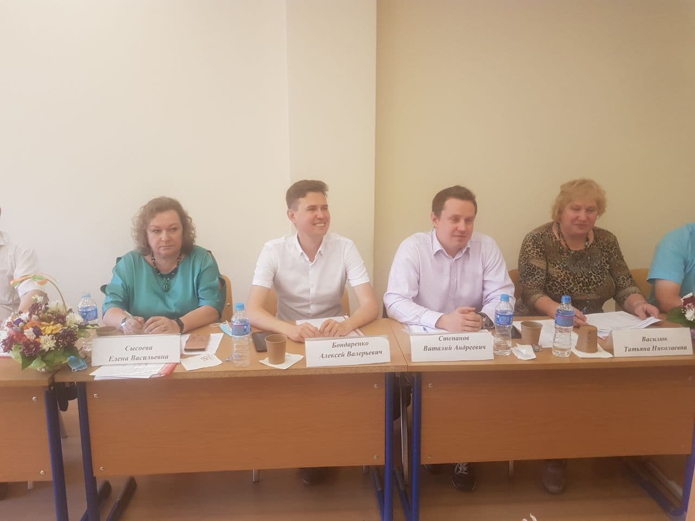
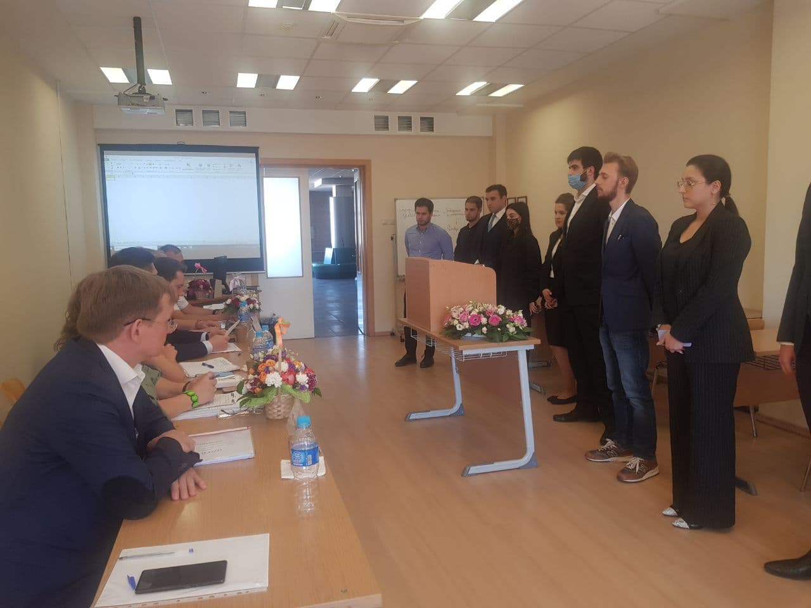
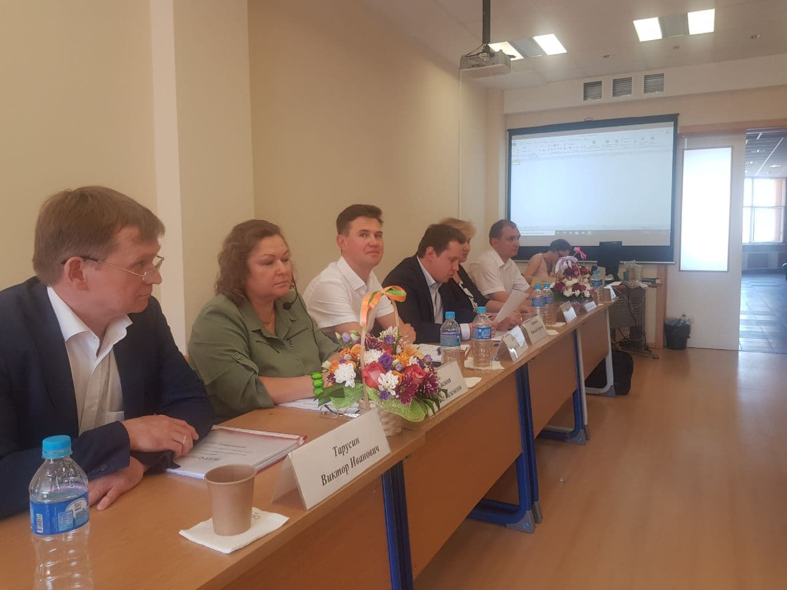
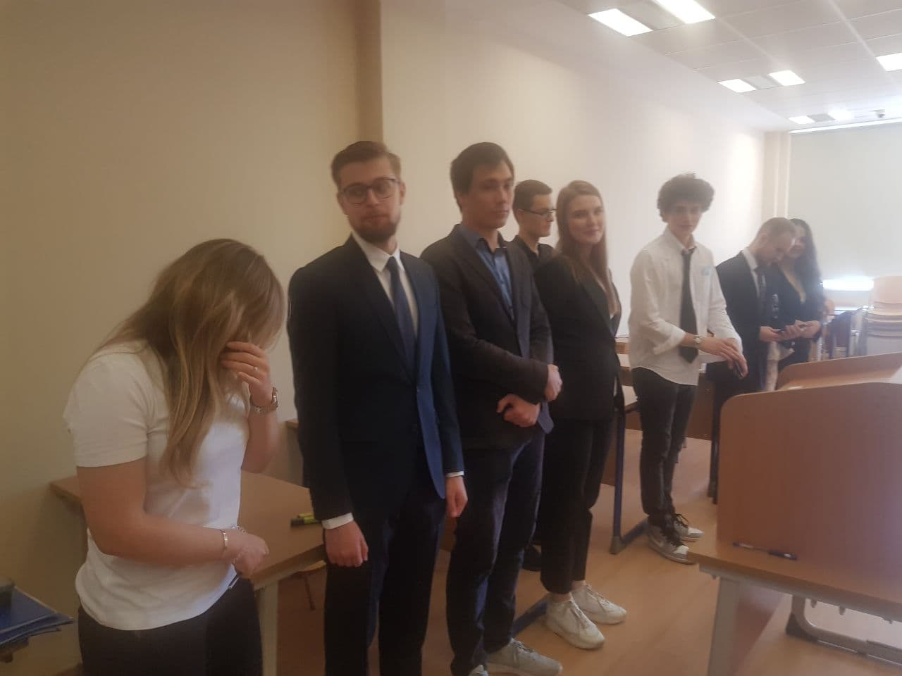
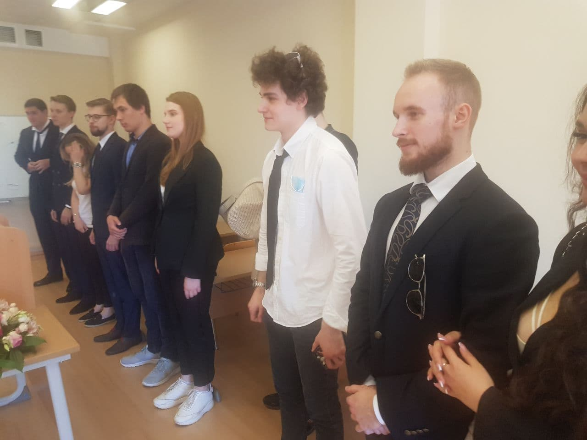
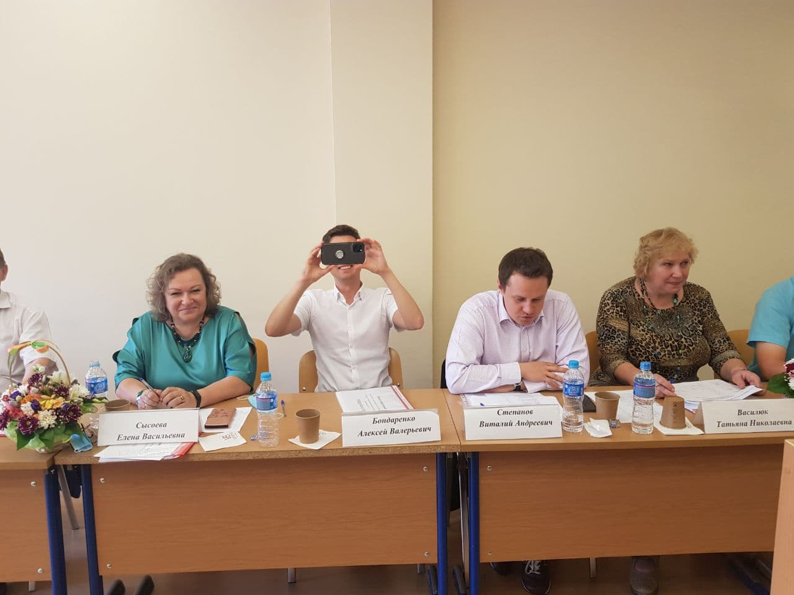
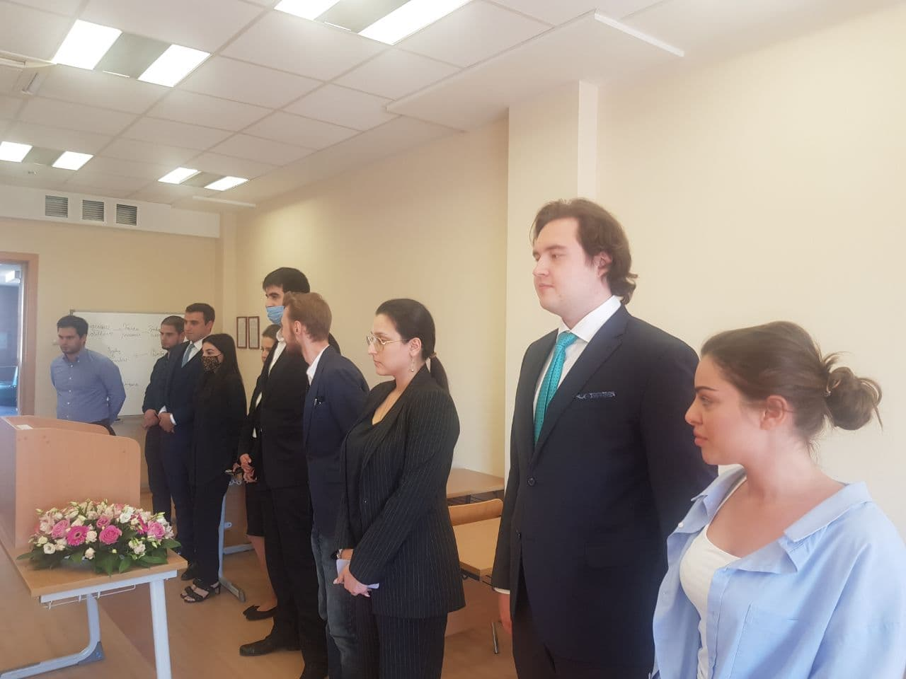
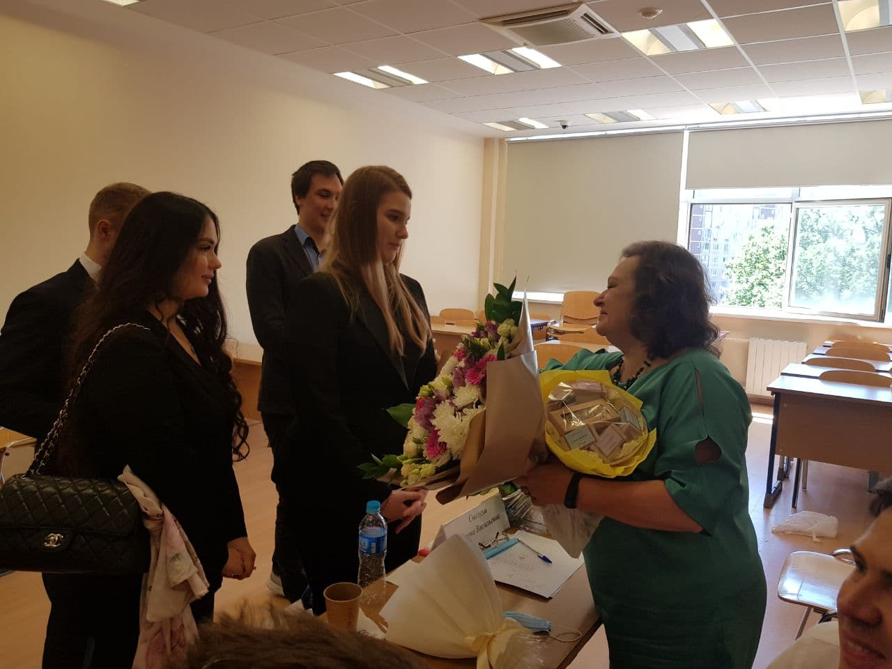

Результаты междисциплинарного экзамена выпускников-бакалавров направления
"Менеджмент" прокомментировал декан факультета финансовой экономики Е.В.Погребняк.

#### Ход экзамена

Хочется отметить интерес студентов к программе и к проблематике, которую они изучают. Есть прямая связь с предметами специализации и с тем, что спрашивают от молодых специалистов на новых местах работы. И по отзывам самих студентов, вот этого багажа знаний хватает с лихвой. Причем слово “багаж” не очень удачное, потому что багаж - это что-то пассивное (ноша, груз). А здесь знания очень активные и активно применяющиеся.

Студенты хорошо структурировали ответы, была логика и развитие темы, были качественные ответы на вопросы. И даже там, где оценки были ниже чем "отлично" — у нас были четверки и тройки — все равно уровень ответов мне показался очень достойным.

Экзамен программы структурирован по двум тематикам: менеджмент, международная торговля и ситуативная задача. В ситуативной задаче требовалось дать логически обоснованное решение практической ситуации, которая могла возникнуть в работе компании, на производстве или в других областях. Часто это разрешение какой-то кризисной ситуации. И студенты очень хорошо справились с этой частью работы.

#### Предложения по будущим курсам

По результатам работы комиссии, общению после экзамена по содержанию курсов,
по новым учебным материалам, семинарам, которые мы будем внедрять на нашей программе, на нашем факультете. Среди таких инициатив: семинар по заключению внешнеэкономических сделок, поиску и налаживанию партнерских связей с акцентом на рынки Юго-Восточной Азии. Это первая инициатива.

Вторая инициатива связана с пересечением финансов и экспорта и госполитики. Это поддержка экспорта и экспортное финансирование (export finance).

Мы знаем, что выбор видов и механизмов поддержки экспорта требует глубокого
знания экспортных операций. Меры поддержки тоже требуют избирательного применения для разных типов компаний. Очень важно, чтобы большее количество студентов, молодых специалистов могли освоить такие виды работ, такой функционал. Мы ориентируемся на Московский экспортный центр и на Российский экспортный центр в этой работе.

Также одно из предложений в построении структуры курсов: добавить больше отраслевого акцента в нашей подготовке. Удачные ответы студентов на экзамене были связаны с яркими примерами из практики, с примерами из их текущей работы.

Для тех, кто уже работает, и мы видим, что связать концепции, понятия из экономики, финансов, менеджмента гораздо проще в применении к конкретной отрасли. Трудоустройство студентов будет связано именно с работой в конкретных отраслях. Мы можем усовершенствовать нашу подготовку студентов и дать им уже на ранней стадии карьеры возможность попробовать отраслевую специализацию.
Также пригодятся навыки обобщения и перенос опыта работы из одних отраслей на другие.

Таких результатов мог бы достичь специализированный семинар "Отраслевой анализ" или "Отраслевые проблемы управления” для наших студентов. Причем, мне кажется, что некоторые студенты уже могли бы стать спикерами и даже в скором времени преподавателями на таком семинаре. Здоровый аппетит к знаниям и интерес ко входу в профессию, к совершенствованию в этой профессии позволяет очень быстро накопить такие компетенции и уже рассказать что-то важное другим, например, про фармацевтический рынок.

### Отзывы студентов

После завершения экзамена студенты очень ярко поблагодарили комиссию и руководителя программы Татьяну Николаевну Василюк за профессиональный и личностный рост на программе, за уверенность в своих навыках и профессионализме. Это было очень трогательно и неожиданно для нас.

