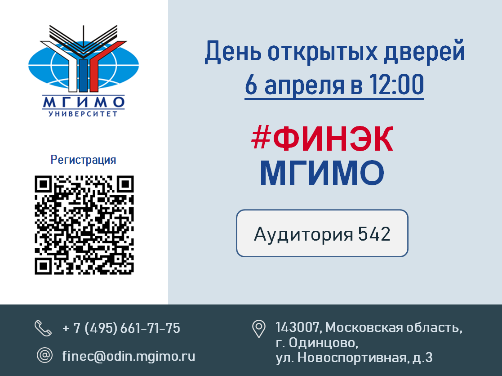

[econ]: /program/undergrad/economics
[itmb]: /program/undergrad/itmb
[mgt]: /program/undergrad/management
[tourism]: /program/undergrad/tourism
[ai]: https://ai.mgimo.ru
[digital]: /program/masters/digital-finance

<!-- Перенаправить сюда digital finance. -->

[bac-badge]: https://img.shields.io/badge/-Бакалавриат-2892D7
[mag-badge]: https://img.shields.io/badge/-Магистратура-1EB3A1
[econ-badge]: https://img.shields.io/badge/Экономика-ФЭТ-2892D7
[mgt-badge]: https://img.shields.io/badge/Менеджмент-МКИ-2892D7
[bi-badge]: https://img.shields.io/badge/Бизнес--информатика-ИТМБ-2892D7
[t-badge]: https://img.shields.io/badge/Туризм-ТиГ-2892D7
[econ-badge-mag]: https://img.shields.io/badge/Экономика-Цифровые_финансы-1EB3A1
[bi-badge-mag]: https://img.shields.io/badge/Бизнес--информатика-Искусственный_интеллект-1EB3A1

[![Бакалавриат][bac-badge]](program/undergrad/)
[![][econ-badge]][econ]
[![][bi-badge]][itmb]
[![][mgt-badge]][mgt]
[![][t-badge]][tourism]  
[![Магистратура][mag-badge]](program/masters/)
[![][econ-badge-mag]][digital]
[![][bi-badge-mag]][ai]

## Поступление на Финэк МГИМО

Декан факультета Финансовой экономики Е.В.Погребняк: «В 2024 году Факультет финансовой экономики МГИМО ведет прием на программы бакалавриата и магистратуры по экономике, бизнес-информатике, менеджменту и туризму. Все программы бакалавриата Финэка МГИМО дают прочную базу для успешной карьеры в корпоративном или государственном секторе, развития собственных проектов, в том числе в креативных индустриях, применения на практике востребованных аналитических, управленческих и цифровых навыков, продолжения учебы в магистратуре и аспирантуре».

### Особенности обучения на программах факультета

- Со второго курса студенты выбирают дополнительные учебные модули
(майноры) по предпринимательству и стартапам, анализу данных или
финансам.
- Во все программы включены модули Цифровой кафедры МГИМО с
интенсивами на базе «Школы 21» — школы программирования от
Сбера.
- Реализуются выездные учебные модули по России, а на третьем курсе
действует программа зарубежных академических обменов.
- Мы выпускаем с английским на уровне С1 и вторым иностранным
языком (китайским или европейским).

### Поступление

Для поступления на факультет не требуются дополнительные вступительные испытания. Вам достаточно сдать необходимые предметы ЕГЭ и набрать в сумме проходной балл, который определяется по рейтингу поступающих.

Какая программа Финэка подходит именно вам? Читайте интервью декана на [портале МГИМО](https://mgimo.ru/about/news/main/finec-2022/) или [на сайте факультета в расширенной версии](about/interview).

### Консультация по поступлению

Как получить консультацию по поступлению на Финэк МГИМО? Задайте вопрос с помощью формы ниже —
на него вам ответят Ю.В.Дворникова, заместитель декана факультета финансовой экономики МГИМО,
и руководители наших программ.

<a class="btn btn-primary btn-lg px-4 mb-2"  href="https://forms.gle/tRBb3VAGNyV53uAv5" role="button">Задайте вопрос о поступлении на Финэк</a>

## События факультета

Дорогие друзья!

Приглашаем вас **6 апреля в 12:00** на день открытых дверей

Декан факультета Е.В. Погребняк и научные руководители программ бакалавриата расскажут об учебных программах, реализуемых в 2024-2025 учебном году, какие виды ЕГЭ необходимы для поступления, как будет проходить приемная кампания и что изменилось в этом году.

Вы узнаете, как выбрать между нашими бакалаврскими программами и чем отличается будущая карьера выпускников разных программ:

-	Экономика «Финансовая экономика и финансовые технологии»
-	Туризм «Туризм и индустрия гостеприимства»
-	Бизнес-информатика «Информационные технологии в международном бизнесе»
-	Менеджмент «Менеджмент в креативных индустриях»

На встрече будет возможность лично пообщаться с деканом факультета, руководителями программ, преподавателями и нашими студентами.

Ждем вас в Одинцовском кампусе МГИМО МИД России

По адресу: 143007, Московская область, г. Одинцово, 
ул. Новоспортивная, д.3

**аудитория 542**

Для участия требуется пройти короткую [регистрацию](https://docs.google.com/forms/d/e/1FAIpQLSfhoS1Zw8kOGH2jVB42lQIVGew5nUZYib39q_MMA7xLQlqg4g/viewform). 
Для входа необходимо иметь при себе оригинал паспорта.



&nbsp;



&nbsp;



<!-- Файлы:

/data/banners.yaml
/images/index-banners/*

-->



## Кампус МГИМО-Одинцово

Факультет расположен на собственном кампусе МГИМО в Одинцово
с уютной рабочей атмосферой, современным техническим оснащением
и собственным спорткомплексом с бассейном.


