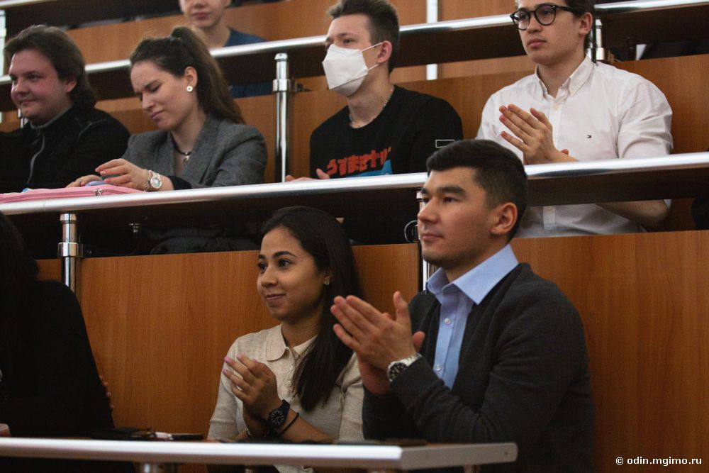

[econ]: /program/undergrad/economics
[management]: /program/undergrad/management
[itmb]: /program/undergrad/itmb



На открытии мероприятия выступили соорганизатор и программный директор [Фестиваля актуального научного кино](https://web.facebook.com/csffest/) Ирина Белых и декан Факультета финансовой экономики Е.В.Погребняк. На встрече также присутствовали организаторы мероприятия — заместитель начальника Отдела по социальной и молодежной политике Юлия Гарбар, координатор Культурного центра Мария Оболенская и заместитель декана Факультета финансовой экономики Ю.В.Дворникова.



Студенты проявили большой интерес к мероприятию: показ посетили не только студенты МГИМО-Одинцово, но и студенты МГИМО-Ташкент и МГИМО на пр. Вернадского.
Причем начало просмотра в 9 утра не испугало (там мы смогли вписаться в плотный учебный график).

> Николай Шувалов [][itmb] так рассказал о фильме: «Финансы в целом и деньги в частности — это очень интересная штука: о них знает каждый, но при этом четкого представления о них не имеет почти никто. [Фильм „Откуда берутся деньги?“](https://dnk.csff.ru/films/view?id=113) отлично показывает каким образом работает гигантская финансовая машина». В дискуссии Николай добавил, что повествование на его вкус развивалось достаточно медленно, динамика возникла в конце.



После просмотра у участников возник ряд вопросов, которые они смогли обсудить в оживленной дискуссии. Обсуждение поддержала заведующая кафедрой менеджмента факультета финансовой экономики Т.Н. Василюк, озвучив экспертное мнение по поводу возможных рисков и будущих потрясений в финансовой сфере.



> Анна Скобцова [][management]: «Просмотр фильма заставил меня задуматься над некоторыми важными вопросами: нужно ли оттягивать неизбежный финансовый кризис, чтобы выиграть время для поиска альтернатив, или же это не поможет? Какими вообще могут быть альтернативы? Какова роль инфляции в этой системе? Однозначных ответов у нас пока нет, но это и делает данную проблему столь важной. Надеюсь, сегодняшним мероприятием наше знакомство с интересным кино не закончится».

Организаторы мероприятия высказали заинтересованность в дальнейшей организации просмотров и обсуждений авторских фильмов на различную тематику на площадке МГИМО-Одинцово.



> Е.В. Погребняк: «Фильм оставляет ощущение того, что мир сползает в новый, более глубокий долговой кризис. Наше, пусть даже краткое обсуждение, показало, что знания о возможных механизмах такого кризиса — ценный навык, особенно для молодых людей, для которых трансформация финансовой системы — не только риск, но и новая сфера возможностей. Мы благодарны Ирине Белых за представление фильма и интересные предложения на будущее — сделать документальное кино частью студенческой и профессиональной культурной жизни нашего факультета и МГИМО-Одинцово. На примере сегодняшнего фильма мы видим, что наши студенты — не только заинтересованные зрители, но и активные участники обсуждения, в котором затрагивались проблемы роста закредитованности экономики, госдолга, роли банков и шире — уклада жизни в современном обществе. Уверен, именно таких зрителей и хотели бы привлечь авторы фильма».



Ирина Белых: «Я очень рада, что мы начали сотрудничество с новой площадкой. МГИМО — один из ведущих вузов страны с невероятной историей и выпускниками. Мне было очень интересно встретиться со студентами и преподавателями, узнать, что происходит в вузе сегодня и обсудить наш фильм с будущими экономистами. Кажется, у нас получилась интересная дискуссия!»

В заключение Ю.Гарбар отметила, что интерес, проявленный студентами к такому интерактивному формату обучения, может стать прочной основой для проведения целой серии подобных мероприятий.

**Отдел по социальной и молодежной политике**  
**Факультет финансовой экономики**

### Трейлер фильма



### Фото обсуждения

