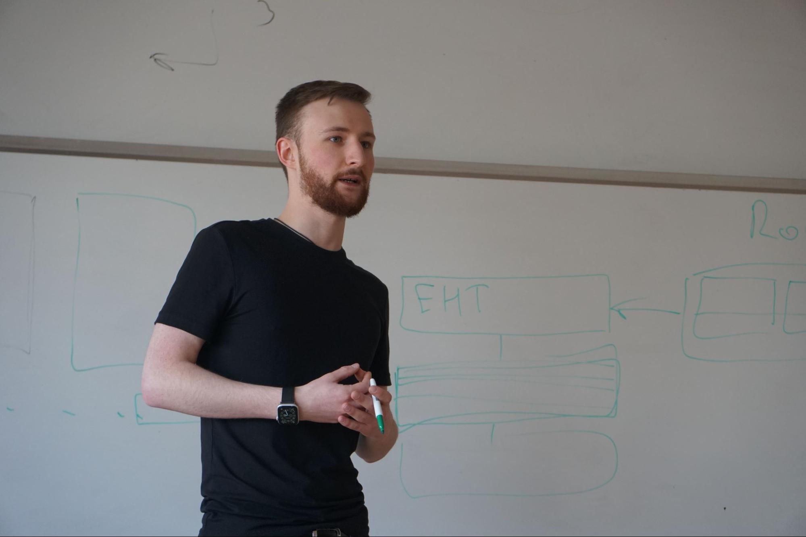
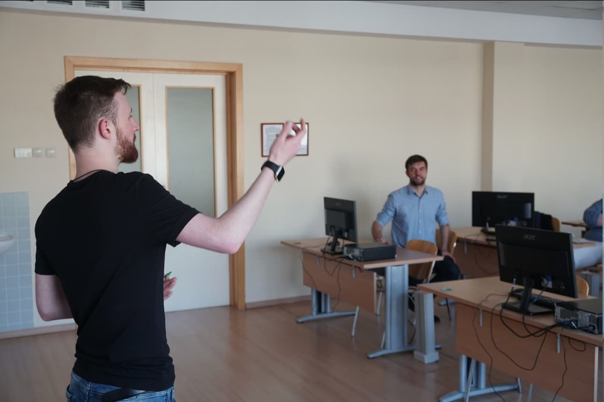

В понедельник 4 октября к занятию по курсу "Финансовые технологии и цифровые компетенции будущего" на программе "Финансовые технологии" в качестве гостевых спикеров присоединились выпускники бакалаврской программы Финэка МГИМО "Информационные технологии в международном бизнесе" Павел Гусев и Владимир Гурьев, сооснователи фонда [Digital Assets Capital](https://t.me/da_capital), который занимается управлением капиталом, трейдингом, размещением средств в протоколах децентрализованного кредитования, маркет-мейкингом и венчурными инвестициями.

Основная тема занятия - каким будет мир цифровой экономики и какие новые направления существуют в децентрализованных финансах. Обычно такая дискуссия идет вокруг курсов криптовалют и их сравнения, а также перспектив регулирования "крипты". Нам повезло узнать чуть больше и обсудить более широкий набор тем.

Павел Гусев рассказал об "игровых финансах" (PlayFi) на примере популярной игры Axie Infinity [AXS](https://whitepaper.axieinfinity.com/). В традиционных играх игроки не могут перенести созданные ценности (например, персонажей) за контур игры. Децентрализованная архитектура игр нового поколения позволяет построить "с нуля" экономическую модель игры, обеспечивающую защиту цифровых активов, стабильные правила работы с ними, возможность обмена и заработка для участников.

Криптогейминг - это способ организации расчетов внутри игр на основе распределенного реестра. Это новая и крайне динамичная область, в которой нужны специалисты, знающие технологии (на каком блокчейне реализованы расчеты и что прописано в смарт-контрактах), экономику (имеют ли расчеты смысл, как будут формироваться цены внутри игры) и дизайн игровых продуктов (почему люди играют в онлайн игры и что их будет привлекать в таких играх в будущем).

Наши гости Павел и Владимир особенно подчеркнули, что корпоративная этика их проекта базируется на девизе "трать время на то, что приносит тебе удовлетворение". Внутри проектов фонда Digital Assets Capital члены команды находят себя в технической, аналитической, креативной, управленческой, международной сфере деятельности, построении коммуникаций с клиентами и партнерами.

Мы планируем продолжить серию открытых семинаров с участием наших выпускников, чтобы рассказать о том, как быстро войти и лучше сориентироваться в сфере децентрализованных финансов и технологий распределенного реестра, включая следующие темы:

- основы распределенной цифровой экономики (блокчейн, смарт-контракты, оракулы)
- токены и их виды - что такое токеномика?
- биржи, трейдинг, деривативы и управление риском
- криптогейминг - "спорт с холодным расчетом"
- информационная безопасность
- медиапроекты
- безумие NFT и что его подталкивает
- венчурные проекты в области распределенного реестра – как не прохлопать хорошую идею и довести ее до стартапа на миллион долларов
- зачем и как с блокчейном работают крупные корпорации
- анализ данных, программирование и "пощупать" блокчейн руками.

Цель работы Финэка МГИМО в этой области – успешное участие наших студентов в перспективных, быстрорастущих проектах в сфере децентрализованных финансов и технологий распределенного реестра, достаточный уровень компетенций, позволяющий наладить взаимодействие с такими проектами, работая в традиционных финансовых институтах.

Мы создаем возможности для студентов применять свои знания в реальной бизнес-среде - продуктивно работать в командах, выдвигать, защищать и обосновывать инвестиционные и продуктовые идеи, оценивать риски проектов, практиковать навыки публичной презентации своих идей понятным для любой целевой аудитории языком.

Нашим итоговым мероприятием в серии семинаров станет конкурс студенческих бизнес-проектов, где наиболее активные участники и команды представят свои предложения профессиональному жюри. Они смогут претендовать на первый раунд инвестиций в свой проект и получат ценные призы организаторов.

Выпускники Финэка МГИМО менее чем за полтора года создали частный инвестиционный фонд и профессиональную команду, которая насчитывает более 120 человек, которая продолжает расширяться. Попробуйте свои силы и вы - придумайте, каким может быть ваш проект в цифровой экономике, финтехе или трансформации бизнеса и расскажите о нем на нашем семинаре.

