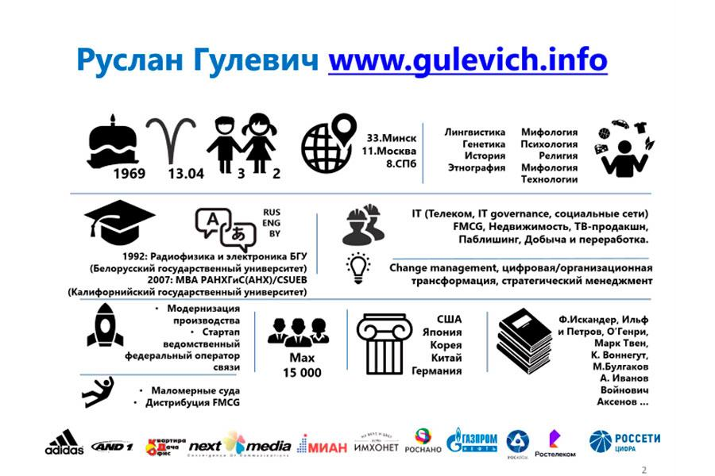

> 14 октября 2021 года в Школе бизнеса МГИМО состоялась онлайн-лекция Руслан Гулевича в рамках программы [Executive MBA](https://emba.mgimo.ru/) на тему «Цифровая трансформация. Люди. Культура. Язык». Ведущий занятия — декан Финэка МГИМО Евгений Погребняк.

В ходе лекции первый Руслан Гулевич представил альтернативный и немного провокационный взгляд на цифровую трансформацию. Вместе со слушателями он поразмышлял на тему того, что является главным объектом цифровизации — процессы, технологии и оборудование или люди, персонал, сотрудники.

Руслан подробно рассказал, чем отличается «айтишник» от «цифровизатора» и на каком языке нужно говорить, чтобы достигнуть взаимопонимания между CIO и CDTO, почему это два разных человека и как их объединить, как обсуждать эффективность и как влияет «цифра» на культуру компании.

Наш гость ответил на вопрос, кто источник идей и стратегий цифровизации и где главная помеха, которую неизбежно выведут за рамки автоматизированных бизнес-процессов в ближайшие годы.

Руслан Гулевич имеет обширный опыт работы в цифровизации в сырьевом и технологическом секторе. Автор ежегодного «Малого питерского цифрового словаря», где «о цифре» написано с юмором.



---

[Оригинал новости на сайте Школы бизнеса МГИМО](https://mba.mgimo.ru/news/gulevich-digital)
