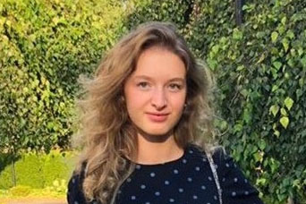

[digital]: /program/masters/digital-finance

С января по март 2022 года компания 1С проводила пятнадцатый Всероссийский профессиональный конкурс по "1С:Бухгалтерии 8". Студентка Финэка МГИМО Анастасия Пантюхова — победитель регионального этапа конкурса — поделилась своими впечатлениями:

    
    </img>

"Конкурс помог мне определиться с выбором темы моей выпускной квалификационной работы, которую я выполняю под руководством [Н.Т. Васильцовой](https://mgimo.ru/people/vasiltsova/).

1С — это базовая платформа для многих организаций, включая наш собственный кампус МГИМО-Одинцово. Конкурс позволяет разобраться с ее возможностями, и, самое главное, задуматься о том, как
компании могут перестроить свою работу, упростить и усовершенствовать бизнес-процессы. Мне кажется, это важная часть цифровизации.

Уверена, что изучение финансовых технологий и автоматизации в сфере финансов сейчас крайне актуально. После завершения бакалавриата я планирую поступление в магистратуру на программу ["Цифровые финансы"][digital]."
