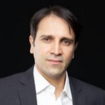
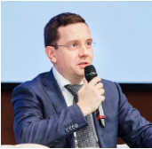
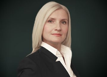

[digital]: /program/masters/digital-finance
[econ-badge-mag]: https://img.shields.io/badge/Экономика-Цифровые_финансы-1EB3A1

[![][econ-badge-mag]][digital]

Круглый стол магистратуры ["Цифровые финансы"][digital] Финэка МГИМО (набор 2022 года).

Дата: 13 июля 2022 года, 18-00

Ведущий – Е.В. Погребняк, декан факультета финансовой экономики МГИМО.

Темы:

- Как меняется сфера влияния современного финансового директора?
- Затраты, точность, скорость – поддается ли качество работы финансового блока измерению?
- Больше, чем производительность: новые внутренние сервисы и бизнес-процессы финблока.
- Финансирование цифровизации и ROI цифровых инициатив - куда пойдут бюджеты и инвестиции?
- Как компании могут воспользоваться финтех-инновациями: платежи, SaaS-услуги, рынки капитала, "embedded finance".
- Большие планы цифровизации и малые шаги, итеративные изменения. Отличия больших и малых компаний.
- Кто идеальный молодой специалист команды цифрового CFO? Чему должен научить вуз? Как вузу сработать на опережение? Что практики могут дать студентам: кейсы и задачи.

Вопросы гостям:

1. Какова ситуация и значимые тренды в цифровизации финансового блока сейчас? Что поменяется в ближайшее время?
2. Чему и как учить? Каких компетенций не хватает специалистам, которых сейчас нанимают компании?

## Приглашенные участники:

---

**Gianluca Bisceglie**, онлайн-сервис финансовых вычислений Visyond

---

**Пётр Дорожкин**, руководитель Управления финансовой эффективности, Банк ВТБ

---

**Лариса Ефремова**, старший партнер, аудит, компания Юникон

---

**Алексей Калашников**, финансовый директор автомобильного дивизиона группы компаний "Ориент" (Узбекистан)

---

**Юлия Лелина**, старший преподаватель кафедры экономики и финансов Финэка МГИМО и директор по аудиту и автоматизации бизнес-процессов компании "Авиа-центр"

---

**Олег Мазуров**, основатель OMY! SportTech UG (Германия), руководитель Sistema Capital (АФК Система) в 2012-2015 и CEO Allianz Investments (Allianz SE) в 2004-2011

---

**Ирина Одинаева**, управляющий директор департамента финансовых услуг ООО "АксТим" (ex-Accenture в России), стратегического партнера компании "Столото" по цифровизации

---

**Ольга Чумаченко**, директор учебного центра аудиторской компании Юникон

---

### Соруководители магистерской программы ["Цифровые финансы"][digital]:

---

---

**Н.Г. Данилочкина**, д.э.н., профессор кафедры экономики и финансов

---

**Ю.В. Дворникова**, к.э.н., зам.декана факультета финансовой экономики МГИМО

---

Приглашаются абитуриенты магистерской программы ["Цифровые финансы"][digital], а также студенты и преподаватели. Для участия необходимо [зарегистрироваться](https://docs.google.com/forms/d/e/1FAIpQLSdTbeQ3aTncwYZil2nZ0zfR2mSi7UtnefrjqdvH7iPVgebGcQ/viewform).

Программа "Цифровые финансы" Финэка МГИМО: <https://digitalfinance.mgimo.ru/>.
