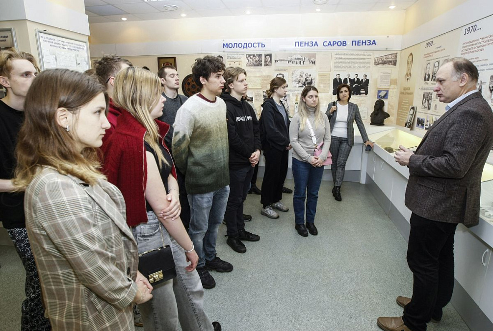

Студенты бакалавриата и магистратуры Факультета финансовой экономики МГИМО вернулись из Нижнего Новгорода, где проходил выездной учебный модуль «Технологии — данные — финансы» в рамках программы «Школа финансов и финансовых технологий», направленной на подготовку специалистов в области экономики и финансов, способных работать в высокотехнологичных секторах экономики. Учебный модуль подготовлен и реализован в рамках программы развития «Приоритет 2030».

Программа модуля была крайне насыщенной и включала в себя мероприятия на трех площадках: филиал РФЯЦ — ВНИИЭФ «Научно-исследовательский институт измерительных систем им. Ю.Е.Седакова» (НИИИС), Цифровая кафедра и Институт информационных технологий, математики и механики Нижегородского государственного университета им. Н.И.Лобачевского и мероприятие Финтех Хаба Банка России, которое проводилось также на базе ННГУ.

В рамках междисциплинарного семинара на базе НИИИС студенты узнали о последних разработках в области квантовых и фотонных технологий и в том числе о перспективах их применения в финансовой сфере. Вместе с экспертами-практиками ребята изучили системы полного жизненного цикла «Цифровое предприятие», а также приняли участие в дискуссии о развитии ядерной энергетики в контексте современной экологической повестки и задач поддержания технологического суверенитета нашей страны. В рамках семинара студенты также изучили процесс проектирования микросхем и смогли лично познакомиться со всеми стадиями производства микроэлектроники.

Кроме того, студенты посетили институт Информационных технологий, математики и механики Нижегородского государственного университета им. Н.И.Лобачевского, где узнали об истории и достижениях вошедшего в институт факультета ВМК, недавно отпраздновавшего свое 60-летие. Отдельная лекция была посвящена высокопроизводительным вычислениям и их будущему применению в различных отраслях экономики.

В завершении визита студенты посетили защиту проектов — итоговое отчетное мероприятие программы «Финансовые технологии и инновации в платежах», организованной Финтех Хабом Банка России. На защите студенты-участники образовательной программы представили презентации концепций инновационных продуктов и сервисов в области финтеха, разработанные за несколько недель обучения.

Студенты 3 курса программы «Финансовая экономика и финансовые технологии», участвовавшие в выездном модуле, в следующем году также смогут присоединиться к аналогичной программе Финтех Хаба Банка России, посвященной платежным системам. Текущий визит позволил познакомиться с направлениями развития платежных сервисов, а также с форматом работы на программе и требованиями к итоговым проектам.

В рамках учебного модуля «Технологии — данные — финансы» наши студенты также подготовили и защитили групповые проекты по управлению технологическим развитием, инвестициями в новые производства, управлению рисками.

Студенты, впервые ставшие участниками выездного модуля, поделились своими впечатлениями о поездке.

«Лекции и мастер-классы о создании и использовании технологий были очень насыщенными, — рассказала студентка 2 курса программы „Финансовая экономика и финансовые технологии“ Юлиана Юруткина. — Мы узнали о реальных проектах, над которыми работают конкретные специалисты на предприятиях. Все выступающие были искренне заинтересованы поделиться своим опытом и старались помочь нам побыстрее разобраться в сложных технологических аспектах.»

Особенно интересным студентам показалось посещение предприятия по производству микроэлектроники и чипов. «Мы своими глазами увидели все этапы производства, начиная от создания дизайна чипа на компьютере до финальной сборки и тестирования продукта. Удивительно, что в начале цикла микросхема — это программа на особом языке программирования, а затем этот дизайн переносится на кремниевую пластину, — отметила студентка первого курса магистратуры „Цифровые финансы“ Анна Овчинникова. — Было очень познавательно увидеть, как принципы организации производства, которые мы изучаем в университете, применяются на практике, это дает много новых идей для проектов и дипломной работы».

Экскурсии по городу позволили студентам познакомиться с культурой и историей Нижнего Новгорода. «Мы посетили все ключевые достопримечательности, такие как Кремль, Покровская улица и площадь Минина, стрелка рек Волги и Оки, — рассказала Юлиана Юруткина. — Мне очень понравилась архитектура и атмосфера Нижнего Новгорода».

Участники поблагодарили коллег из организаций-партнеров, участвовавших в подготовке и реализации учебного модуля, а также декана Факультета финансовой экономики Е.В.Погребняка, заместителя декана Ю.В.Дворникову и специалиста кафедры финансов и финансового менеджмента Т.А.Быстрову, сопровождавших студентов в поездке. «Мы уверены, что эта поездка запомнится как одно из самых ярких и значимых событий в нашей учебной жизни — не только по насыщенному содержанию, но гостеприимству и вниманию во всех местах нашего пребывания в Нижнем Новгороде», — поделились студенты.

Организаторы модуля отмечают, что опыт его проведения будет учтен при совершенствовании учебных программ факультета, направленного на расширение проектной составляющей и индивидуализацию обучения на основе системы «майноров» и курсов по выбору.

