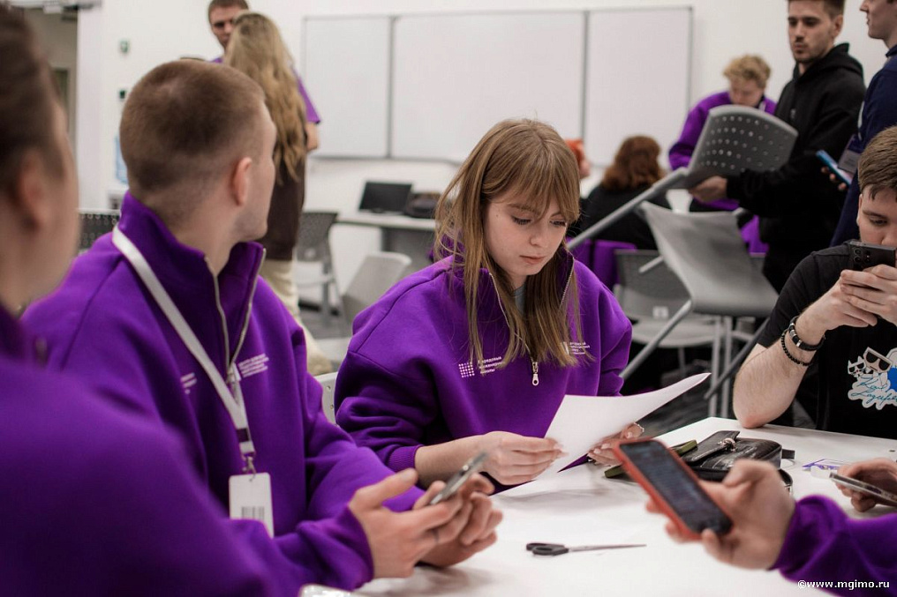

С 29 января по 2 февраля студенты Факультета финансовой экономики МГИМО, обучающиеся по программе «Информационные технологии в международном бизнесе» приняли участие в образовательном проекте «Зимняя школа для бакалавров» от университета Иннополис.

В течение недели 150 участников из 26 регионов и 46 университетов страны посещали лекции, участвовали в мастер-классах и воркшопах по следующим образовательным трекам:

- Программная инженерия
- Информационная безопасность + Кибербезопасность
- Анализ данных и ИИ + Управление на основе данных
- Робототехника
- Технологическое предпринимательство + Управление цифровым продуктом
- Управление разработкой компьютерных игр.

В рамках Зимней школы участники расширили свой круг профессиональных компетенций, взаимодействуя с ведущими экспертами крупнейших российских IT-компаний, а также узнали о новых реализованных проектах и стартапах.

Команду студентов МГИМО (Одинцово) представляли студенты 4 курса, участники IT-клуба Максим Лушкин, Владислав Богун, Алексей Соколов, Алексей Баранов, Тимур Низамеев, Анастасия Попова, Анна Денисова. Результаты обучения студентам предстоит использовать при написании своих выпускных квалификационных работ.

Студенты отметили, что «Зимняя школа в Иннополисе — это действительно классная возможность пообщаться со специалистами ИТ-отрасли, а также со студентами буквально со всей России, поделиться опытом и дать старт развитию своих новых идей!»
