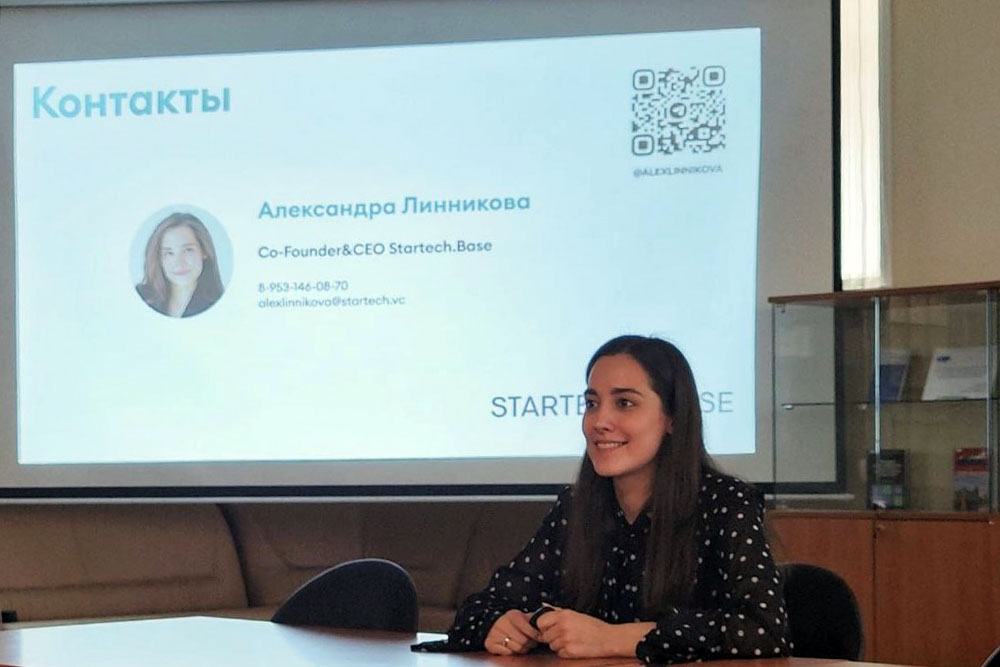

17 апреля студенты Факультета финансовой экономики и члены студенческого клуба Ódin Business Club стали участниками мастер-класса соруководителя MGIMO Ventures, операционного директора программ Startech.vs и соучредителя и генерального директора Startech.base Александры Линниковой.

На встрече Александра рассказала, как создается и развивается стартап, поделилась секретами поиска бизнес-идей, формирования сильной команды и успешной реализации бизнеса.

Благодаря формату Open talk, будущие предприниматели имели возможность обсудить со спикером волнующие их вопросы.

Участница мастер-класса Юлианна Юруткина поделилась своими впечатлениями по итогам встречи: «Для нас, студентов, обучающихся на майноре „Предпринимательство“, сегодняшняя встреча была особенно полезной, мы получили ценные практические советы, которые помогут нам продвинуться в достижении своей цели: в первую очередь, нужно иметь четкую видимость своей цели, хорошо понимать к чему важно стремиться в итоге; если оригинальных идей для стартапа пока нет, импортозамещение — хорошая возможность создать свой бизнес; важно тщательно изучить рынок, чтобы определить боли и нужны потребителей и разработать продукт или услугу, решающую их проблемы; нужно иметь уверенность в своих силах и быть готовым к тому, что все может пойти не по плану; очень важно создать команду из профессионалов, готовых делиться вами энергией, навыками и мотивацией. Необходимо активно развивать коммуникабельность и расширять круг деловых связей, от этого во многом зависит успех вашего стартапа. Хотелось бы поблагодарить Александру Линникову за возможность прямого общения с экспертом и отметить особую ценность кейсов живого опыта управления стартапами».

В завершение встречи спикер и участники наметили новую встречу для продолжения диалога о технологическом предпринимательстве и не только.
