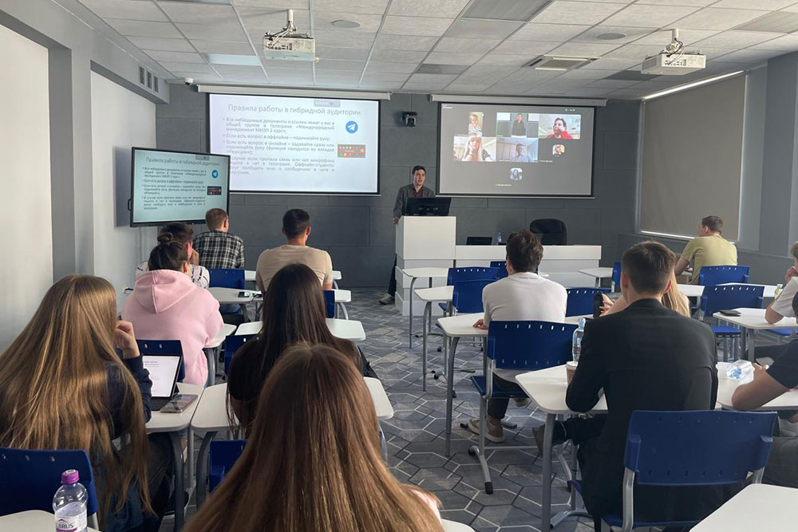

23 мая преподаватель кафедры менеджмента Факультета финансовой экономики А.А.Вадов провел мастер-класс в гибридной аудитории МГИМО для студентов 2-го курса МИЭП программы «Международный бизнес и управление инновациями» в рамках учебно-методической стажировки по преподаванию в гибридном формате.

Мероприятие организовано Школой бизнеса и международных компетенций МГИМО совместно с Центром преподавательского мастерства в бизнес-образовании ВШМ СПбГУ.

На мастер-классе студенты МИЭПа узнали, что такое дата-продукты, научились их распознавать в бизнес-процессах и самостоятельно выполнили групповое кейс-задание по разработке дата-продуктов. Данная тема является составной частью образовательного курса «Экономика данных. Развитие бизнеса на основе данных (Data Governance)» Факультета финансовой экономики МГИМО.

