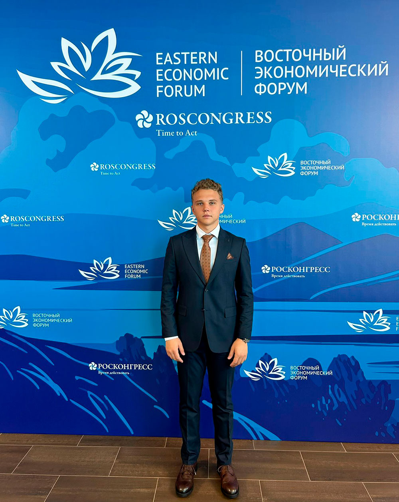

**6 сентября** на площадке Дальневосточного федерального университета в рамках проведения Восточного экономического форума прошел Молодежный день, участником которого стал студент второго курса, обучающийся на программе «Финансовая экономика и финансовые технологии» Даниил Семененко.

В рамках Молодежного дня ВЭФ Даниилу удалось побывать на ряде сессий, посвященных развитию коммуникаций молодежи разных стран, экономическому сотрудничеству России, Китая, Индии в форматах БРИКС и РИК на Евразийском пространстве. Также удалось посетить дискуссионное заседание, организованное членами МГИМО. На заседании обсуждалось международное молодежное сотрудничество в рамках БРИКС+.

Кроме этого, Даниил принял участие в дискуссии «30 вопросов миллиардеру», в ходе которой основным спикером выступил совладелец и президент ДНС Дмитрий Алексеев.

Девиз молодежной программы Восточного экономического форума в 2024 году — «День будущего» — отражает приоритеты развития России на ближайшие годы. Ведь ориентированность программы на практическое взаимодействие молодежи и профессионалов в различных областях способствует формированию будущего страны и общества.

Моя цель — стать квалифицированным специалистом и развить свою экспертность. Я стремлюсь к постоянному развитию и совершенствованию, чтобы в будущем внести значительный вклад в развитие креативных индустрий. Я верю, что знания и опыт, полученные в МГИМО, помогут мне не только достичь высоких профессиональных высот, но и стать наставником для тех, кто только начинает свой путь в этой увлекательной и динамичной сфере. Моя миссия — помогать компаниям, а также расти и развиваться через эффективное управление и инновационные подходы в организации процессов и маркетинговых кампаний. Я полон решимости продолжать свой путь, принося пользу и вдохновение всем, с кем я работаю.
