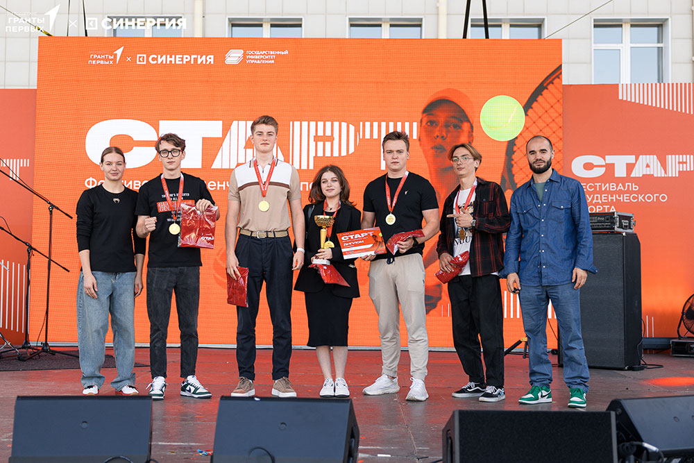

12–14 сентября в рамках Фестиваля студенческого спорта «Старт» на базе Государственного университета управления состоялись соревнования Московской области по спортивному программированию по дисциплине «Программирование продуктовое».

На протяжении двух дней студенты трудились над созданием цифровой платформы, которая позволяла бы участникам Фестиваля регистрироваться, отслеживать турнирные таблицы в режиме реального времени, просматривать расписание соревнований и размещать фото- и видеоотчеты с прошедших мероприятий. 

14 сентября, во время презентации проектов, наша команда продемонстрировала блестящий результат и одержала победу. В чемпионский состав МГИМО-Одинцово вошли Карина Артунян, Павел Шамшин, Григорий Матиевич, Егор Лукашов, обучающиеся на программе «Информационные технологии в международном бизнесе» на Факультете финансовой экономики, а также студент Факультета управления и политики Артем Мусин.

Поздравляем ребят с яркой победой и желаем им дальнейших успехов и новых вершин!

