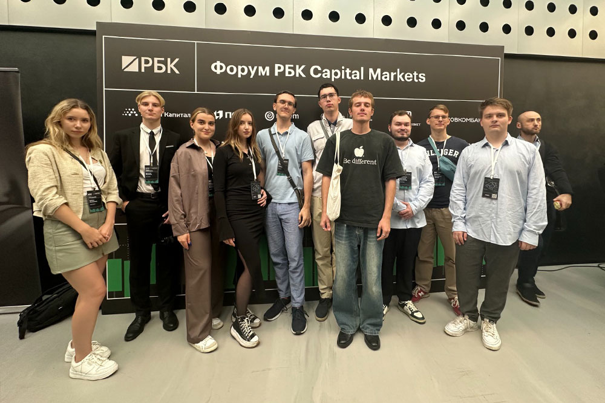

17 сентября члены студенческого клуба «Инвестор Финтеха» приняли участие в форуме РБК «Capital Markets», посвященный рынкам капитала.

На форуме приняли участие спикеры от таких крупных компаний, как Газпромбанк (Татьяна Капустина, вице-президент, начальник Департамента рынков фондового капитала), Iva Technologies (Иван Шкабарня, исполнительный директор), «Группа Аренадата» (Максим Пустовой, генеральный директор ПАО «Группа Аренадата») и другие участники финансового рынка.

На форума выступали заместитель председателя Банка России Алексей Заботкин, заместитель министра финансов РФ Иван Чебесков, генеральный директор УК «Альфа-Капитал» Ирина Кривошеева, президент НАУФОР Алексей Тимофеев, руководитель корпоративно-инвестиционного бизнеса инвестиционного банка Синара Алексей Куприянов, первый заместитель председателя правления ПАО «Совкомбанк» Сергей Хотимский, президент финансово-промышленной корпорации «Гарант-Инвест» Алексей Панфилов. Спикеры в своих выступлениях сконцентрировали внимание на возможных сценариях развития макроэкономики в 2025 г., поясняли проблему привлечения длинных денег в экономику, обратили внимание на возможном охлаждении экономики без рецессии во время борьбы с инфляцией.

Эксперты ВТБ Мои Инвестиции поделились своими стратегиями развития бизнеса в условиях жесткой ДКП.

12 членов клуба «Инвестор Финтеха» и студентов Одинцовского филиала МГИМО приняли участие в форуме, на котором узнали о текущих проблемах на рынке ценных бумаг, о взгляде представителей крупнейших компаний на жесткую ДКП, а также познакомились с инвестиционными стратегиями крупнейших управляющих компаний России.

