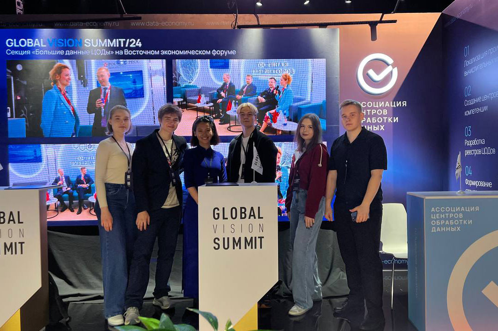

5–6 октября в Москве прошел седьмой Global Vision Summit — международный саммит БРИКС в сфере цифровых активов и больших данных, участие в котором приняли члены MGIMO Crypto Club, студенческого клуба «Инвестор финтеха» и студенты МГИМО.

В ходе саммита участники встречи обсуждали лучшие практики внедрения в Российской Федерации и странах БРИКС цифровых финансовых активов. Отдельно участники встречи остановились на тех проблемах, которые возникают у операторов цифровых финансовых активов, финансовых игроков и инвесторов.

Среди приглашенных спикеров были представители Центрального Банка РФ, Госдумы РФ, ГПБ, МТС, ВЭБ, ВТБ, Мосбиржи, СПБВ, Альфа-Банка, «Яндекса», «Озона», МТС, Ассоциации малой энергетики и другие. Мероприятие проходило при партнерстве с Клубом губернаторов, Московской «Деловой Россией», АЛРИИ и клубом Ledokol.

Повестка встречи: топ-3 стратегии привлечения инвестиций с помощью ЦФА; лучшие кейсы компаний и корпораций, аналитика рынка; высокая ставка ЦБ как драйвер для привлечения частных инвестиций; ЦФА на короткие облигации для увеличения корпоративной ликвидности, как удобный инструмент для корпоративных казначеев; ЦФА для кастодиального хранения золота; ЦФА на бюджетный обязательства, как драйвер рост инвестиционной привлекательности регионов; ЦФА для IPO.

Также на саммите в качестве представителей одной из фирм приняли участие студенты МГИМО, в частности студентка 2 курса МО Чан Тхи Хонг Ньунг. Девять студентов Одинцовского филиала МГИМО получили возможность стать участниками саммита и узнать больше про практики внедрения цифровых активов, проблемы и вызовы, которые стоят перед инвесторами сегодня, а также про майнинг в условиях современной экономики.

