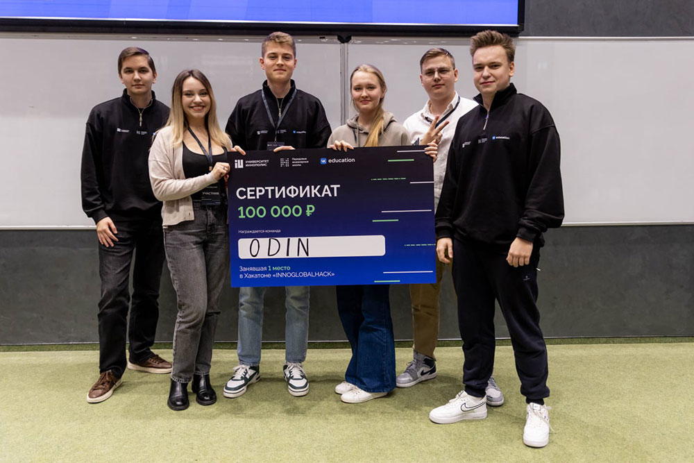

1–4 ноября на базе Университета Иннополис прошел Всероссийский хакатон Innoglobalhack, собравший 200 студентов со всех уголков России. Команда ИТ-клуба МГИМО-Одинцово ODIN победила в конкурсе и заняла I место в треке «Развитие функциональности ИИ-агента Agnia».

Участники были разделены на четыре трека, в рамках которых команды работали над кейсами, представленными передовыми инженерными школами и компаниями VK и МТС. Студентам были предложены задачи по искусственному интеллекту, направленные на увеличение эффективности корпоративных процессов.

Два дня ребята упорно трудились над кейсом, стараясь интегрировать самые полезные сервисы и добавить уникальные функции.

В состав команды победителей вошли студенты программы «Информационные технологии в международном бизнесе» Факультета финансовой экономики Ксения Белоусова, Егор Лукашов и Арсений Никишин, а также студенты Факультета управления и политики Арина Кушнерова и Артём Мусин.

Поздравляем ребят с этой яркой победой и желаем им дальнейших успехов и новых свершений!

[Презентация проекта](https://odin.mgimo.ru/upload/2024/11/presentation-project-odin-agniachallenge.pdf)

