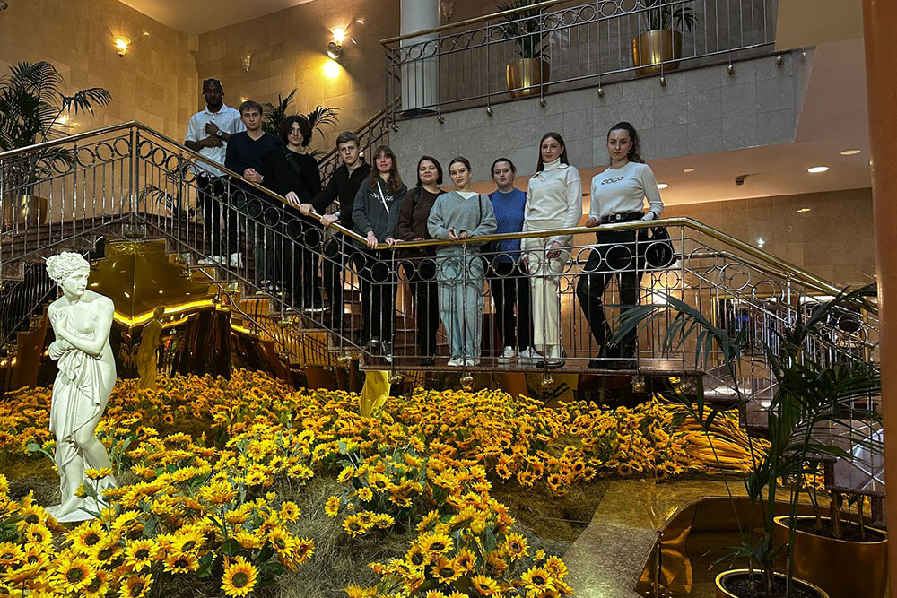

В рамках московского модуля сетевой программы Факультета финансовой экономики МГИМО и Ставропольского государственного аграрного университета студенты двух вузов, обучающиеся на программе «Туризм и индустрия гостеприимства», приняли участие в уникальном образовательном мероприятии под руководством директора по размещению отеля «Золотой кольцо» Р.М.Ольчевой.

Основная цель встречи заключалась в том, чтобы познакомить студентов с особенностями работы одного из ведущих отелей Москвы — «Золотое кольцо». Это мероприятие стало частью образовательной программы, направленной на знакомство с индустрией гостеприимства, что позволило студентам получить практический опыт, который будет полезен при их дальнейшем профессиональном развитии.

Экскурсия по отелю началась с осмотра уникальной «Цветочной террасы» на 22-м этаже, откуда открывается захватывающий вид на столицу и панорамных видовых ресторанов в формате 360 градусов. Далее они посетили роскошный Президентский Люкс и номера для помощников первых лиц, где студенты смогли оценить высокий уровень комфорта и сервиса, предоставляемого самым важным гостям города. Просторные мультифункциональные залы, предназначенные для проведения крупных мероприятий, таких как деловые форумы, банкеты и корпоративные события, произвели неизгладимое впечатление на участников мероприятия.

Однако главной ценностью этой экскурсии стала возможность почувствовать ту неповторимую атмосферу, которую создает команда профессионалов отеля «Золотое кольцо». Атмосфера, наполненная вниманием к каждому гостю, высоким уровнем обслуживания и стремлением сделать пребывание каждого клиента максимально комфортным.

После завершения экскурсии состоялась беседа с Радмилой Ольчевой, в ходе которой она поделилась своим опытом работы в сфере гостеприимства и рассказала о современных тенденциях развития гостиничного бизнеса. Особое внимание было уделено этапам становления специалистов в данной области и возможностям прохождения стажировок в отеле «Золотое кольцо».

Радмила Маратовна подчеркнула важность практической подготовки будущих бакалавров, отметив, что программа «Туризма и индустрии гостеприимства» предоставляет уникальные возможности для приобретения необходимых профессиональных навыков. Она также ответила на многочисленные вопросы студентов, касающиеся карьерных перспектив и особенностей работы в индустрии гостеприимства.

Данное событие стало ярким примером успешного взаимодействия образования и практики, которое позволяет будущим профессионалам получить необходимые знания и навыки для успешной карьеры в индустрии туризма и гостеприимства.

