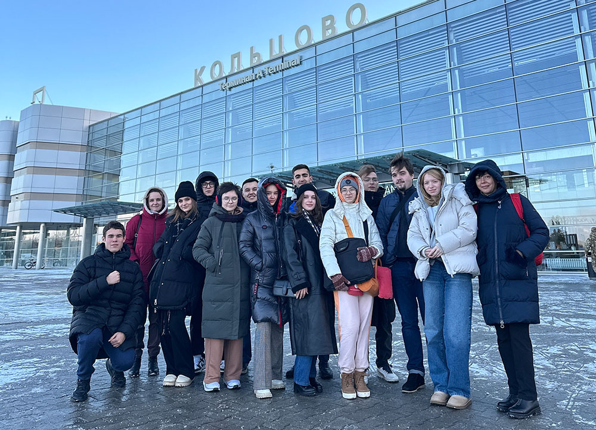
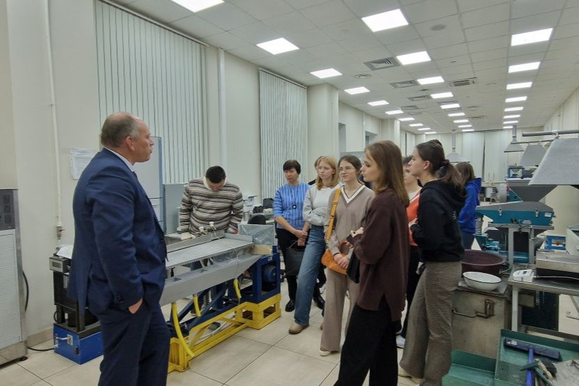
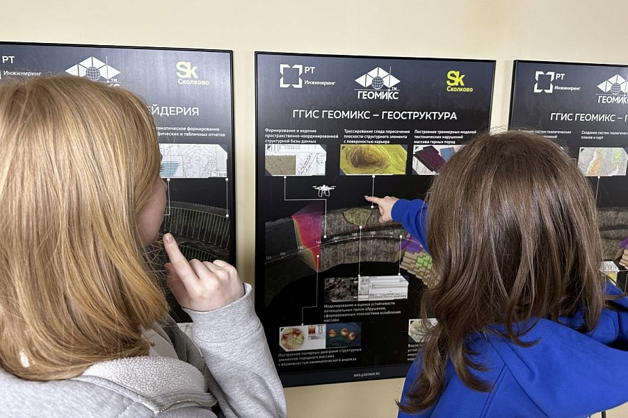
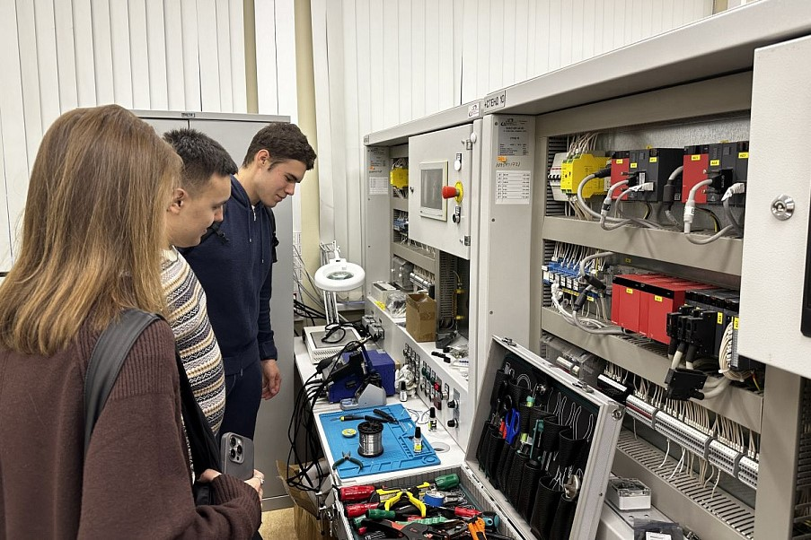

С 11 по 13 ноября прошел выездной учебный модуль Цифровой кафедры МГИМО в Техническом Университете УГМК. Студенты Факультета финансовой экономики МГИМО приняли участие в мастер-классах по информационной безопасности и управлению проектами, а также посетили промышленное предприятие в Свердловской области.

Первый день выездного модуля начался с экскурсии по ТУ УГМК, которую для студентов МГИМО провел директор университета В.А.Лапин. Ребята послушали про образовательные программы и приоритетные направления научных исследований ТУ. Особое впечатление произвели лаборатории, где моделируются месторождения, разрабатываются новые методы и аппараты для получения максимально чистых металлов и селена.

В рамках серии мастер классов участники выездного модуля узнали о современных методах защиты информации и технологиях обеспечения безопасности в IT-системах, а также изучили процесс создания и управления серверами компьютерных игр на примере Minecraft.

В третий день программы для студентов МГИМО была организована экскурсия на промышленное предприятие. Здесь ребята увидели производственные процессы, ознакомились с технологиями производства меди и других металлов и узнали о современных методах автоматизации и цифровизации производства. Это позволило им лучше понять, как современные технологии интегрируются в промышленные процессы.

Завершающим этапом этой первой части учебного модуля в г. Верхняя Пышма в Свердловской области стала экскурсия в музей автомобильной техники, где ребятам рассказали об истории автомобилестроения и современных достижениях в этой отрасли.

Цель выездного модуля — расширение профессиональных знаний и навыков у студентов через посещение различных образовательных и культурных объектов. Все участники выездного модуля отметили ценность полученных знаний и навыков и выразили уверенность, что участие в выездном модуле помогло им лучше понять специфику работы в различных сферах, получить новые цифровые компетенции и подготовиться к будущей профессиональной деятельности.

