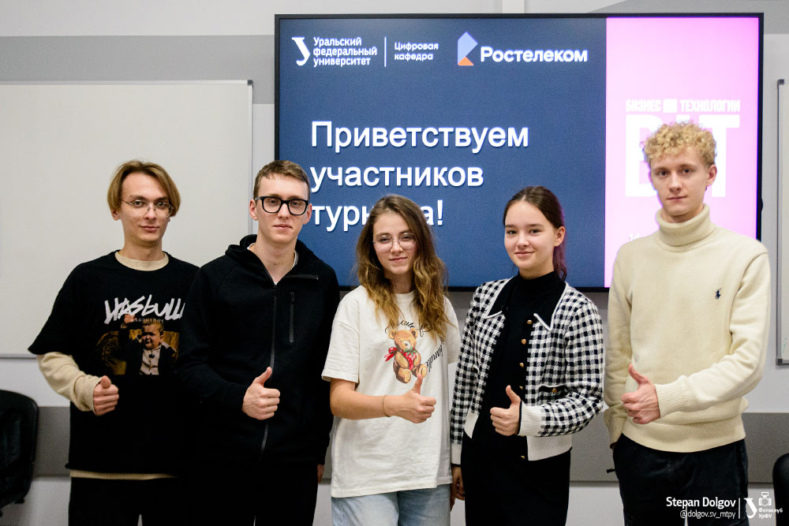

13–15 ноября прошла вторая часть выездного учебного модуля Цифровой кафедры МГИМО в Свердловской области. Студенты Факультета финансовой экономики приняли участие в хакатоне от Цифровой кафедры Уральского федерального университета и заняли первое место с кейсом по цифровой трансформации.

Хакатон BiT Цифровой кафедры УрФУ прошел на площадке Уральской передовой инженерной школы при поддержке ПАО «Ростелеком», индустриального партнера УрФУ. Студенты «цифровых кафедр» МГИМО и УрФУ работали над проектами интеллектуальной системы распознавания визуальных параметров промышленных датчиков.

Используя язык программирования Python и инструменты разметки данных, команды разработали проекты веб-приложений, которые позволяют загружать изображения с показаниями датчиков и получить результаты распознавания в удобном формате. Победителем хакатона стала команда студентов МГИМО, обучающихся на программе «Информационные технологии в международном бизнесе» Факультета финансовой экономики: Павел Шамшин, Григорий Матиевич, Мария Рычкова, Полина Кайсина и Федор Галкин.

В 2022–2023 гг. Федор прошел профессиональную переподготовку на Цифровой кафедре МГИМО по программе «Создание ИТ-продуктов» и получил получил диплом специалиста по продуктам в области информационных технологий. Остальные члены команды в данный момент обучаются на Цифровой кафедре на профильных программах «Управление проектами в области компьютерного зрения и биометрии» (совместно с ООО «ВижнЛабс») и «Управление ИТ-решениями в промышленности: от серверов до сервисов» (совместно с ТУ УГМК).

Мероприятие позволило участникам применить свои навыки в решении индустриальных задач. Целью хакатона было не только создание инновационного продукта, но и развитие навыков командной работы, укрепление межвузовского взаимодействия и повышение уровня профессиональной подготовки студентов в сфере цифровых технологий. Важным аспектом стала интеграция теоретических знаний с практическими задачами реального сектора экономики.

Продолжением программы выездного модуля стал визит в Уральский геологический музей Уральского государственного горного университета, где студенты ознакомились с уникальной коллекцией минералов и уральских самоцветов, а также узнали больше о природных богатствах региона. В заключительный день поездки студенты посетили музей УрФУ, экспозиции которого посвящены истории вуза, его научным достижениям и значимому вкладу в развитие образования и науки на Урале и в стране.

«Эта поездка стала для нас настоящим открытием. За пять дней выездного модуля мы прошли путь от знакомства с вузами региона и предприятиями до активного участия в хакатоне и насыщенных культурных мероприятий в городах Верхняя Пышма и Екатеринбург. Это был уникальный и бесценный опыт!» — поделился впечатлениями один из участников поездки, студент Цифровой кафедры Павел Шамшин (2ФФЭ).

«Мы очень рады, что смогли стать частью выездного модуля Цифровой кафедры, — отметила студентка Цифровой кафедры Полина Фризен (2ФФЭ). — Эта поездка подарила нам множество новых впечатлений и знаний».

Выездной модуль Цифровой кафедры МГИМО, организованный в рамках программы «Приоритет 2030», стал значимой составляющей учебного процесса и предоставил возможность для получения практических навыков, расширения профессиональных горизонтов и установления связей с представителями крупнейших вузов региона и ведущими специалистами отрасли. Подробнее о первой части выездного модуля Цифровой кафедры, который прошел с 11 по 13 ноября в Техническом Университете УГМК, можно прочитать [здесь](https://finec.mgimo.ru/blog/tu-ugmk/).

