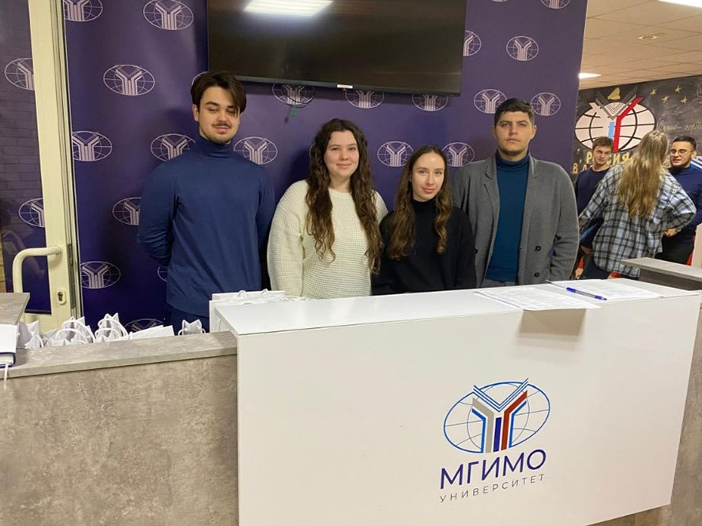

28 ноября студенты Финэка МГИМО приняли участие в VI Международной научно-практической конференции «Развитие современной экономической науки: проблемы, тенденции, перспективы».

Спикерами выступили профессор кафедры национальной экономики и экономического регулирования К.К.Кумехов («Теория и практика применения механизмов государственного регулирования экономики: проблемы и решения»), профессор кафедры финансов и финансового менеджмента М.Ю.Архипова («Современные методы и подходы к анализу и моделированию финансовых и социально-экономических процессов»), доцент кафедры финансов и финансового менеджмента В.Е.Афонина («Цифровая экономика как драйвер экономического и социального развития в современных условиях») и и.о. заведующего кафедрой национальной экономики и экономического регулирования В.А.Безвербный («Рынок труда в условиях цифровой трансформации экономики и дефицита трудовых ресурсов»).

**Целями конференции были:**
1. Привлечение ведущих отечественных и зарубежных ученых и практиков к совместному обсуждению актуальных социально-экономических проблем развития цифровой экономики, определения трендов ее развития и механизмов государственного регулирования процессов цифровизации.
2. Обсуждение развития отдельных видов экономической деятельности с применением методов анализа и моделирования финансовых и социально-экономических процессов, а также выработка рекомендаций по решению ключевых проблем цифровой трансформации в перечисленных областях.
3. Определение ключевых направлений в развитии рынка труда в условиях цифровой трансформации экономики и дефицита трудовых ресурсов.
4. Привлечение представителей власти, бизнеса к экспертному диалогу с научным сообществом и выработке предложений по совершенствованию образовательного процесса в условиях цифровой трансформации.

Студенты Одинцовского филиала МГИМО приняли участие в конференции в качестве волонтеров и получили возможность узнать больше о цифровой трансформации экономического и социального развития в современных условиях России и за рубежом. Студентка 4 курса Финэка Елизавета Ионова выступила с докладом в 3 секции.

