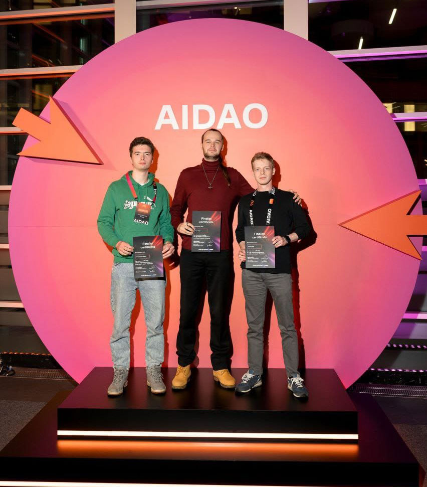

Олимпиада Artificial Intelligence Data Analysis Olympiad (AIDAO) 2024 проходила в два этапа с 5 октября по 2 декабря. На каждом из них участники решали задачи, основанные на реальном запросе индустрии. В рамках онлайн-отбора на первом этапе студенты с помощью ИИ разрабатывали классификацию МРТ-снимков головного мозга человека. Задание было создано научно-учебной лабораторией LAMBDA ФКН НИУ ВШЭ на основании данных Института мозга человека им. Н.П.Бехтеревой Российской академии наук (ИМЧ РАН) и Пекинского педагогического университета.

Всего в первом этапе олимпиады приняли участие 2500 человек. Из них в финальный этап прошли 84 студента в составе 30 команд, в том числе и команда Одинцовского кампуса МГМО.

В состав олимпийской сборной МГИМО-Одинцово вошли студенты 4 курса Факультета финансовой экономики, обучающиеся по программе «Информационные технологии в международном бизнесе»: Егор Бергнер, Даниил Фризен и Степан Мартынович.

В финале олимпиады за 32 часа участникам надо было придумать ИИ-модель компьютерного зрения, которая проверяет машину на наличие вмятин и других дефектов на кузове и в салоне, а также проводит оценку состояния автомобиля перед поездкой. Команды использовали реальные данные — более 200 тысяч фотографий машин из базы «Яндекс Такси». Соревнующиеся обучали ИИ-модель распознавать повреждения на автомобилях.

Решения, идеи и архитектуры в рамках этого мероприятия организаторы планируют внедрить и использовать в ML-сервисах «Яндекса».

«Это была отличная возможность поработать в команде над актуальными и интересными задачами, ощутить радость от полученных решений, пообщаться с другими командами, поделиться своим опытом и поучиться у соперников» — отметили ребята.

Поздравляем их и желаем дальнейших успехов!


