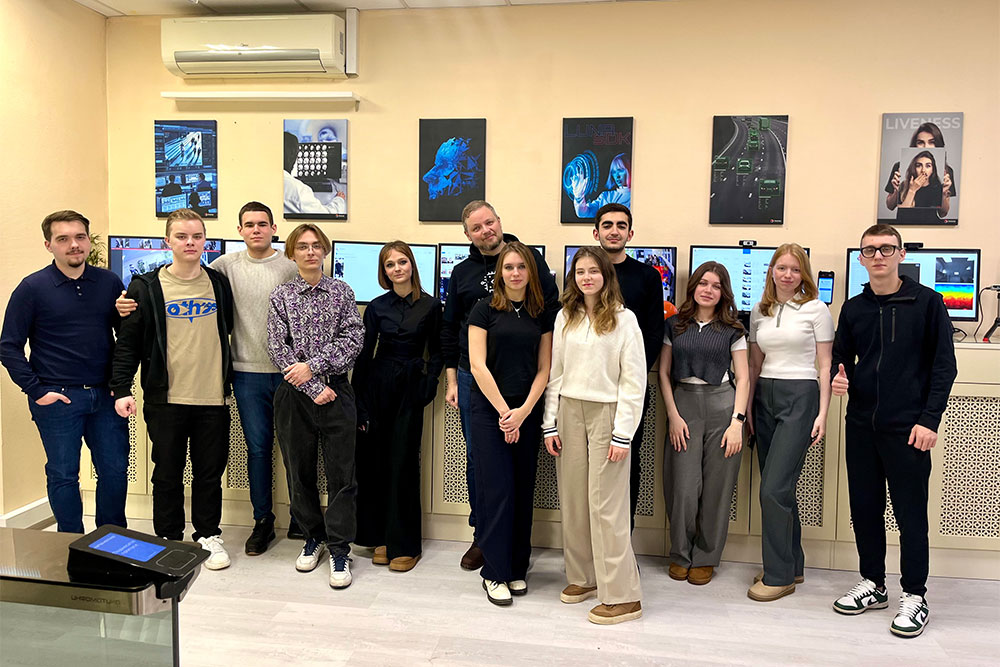

12 декабря студенты программы «Информационные технологии в международном бизнесе» Финэка МГИМО, обучающиеся на программе профпереподготовки от Цифровой кафедры «Управление проектами в области компьютерного зрения и биометрии», посетили офис компании VisionLabs — индустриального партнера Цифровой кафедры. На экскурсии ребята получили возможность познакомиться с передовыми технологиями в области компьютерного зрения и инновационными разработками компании.

Во время визита представители компании рассказали о текущих проектах VisionLabs, включая систему распознавания лиц и использование искусственного интеллекта для анализа больших данных. Особое внимание было уделено прикладному применению этих технологий в различных сферах — от безопасности до медицины.

Один из самых ярких эпизодов визита — испытание, в рамках которого студенты попытались ввести в заблуждение систему распознавания на факт ношения защитной каски на предприятии. Опытным путем ребята выяснили, что искусственный интеллект готов и к таким вызовам: устройство безошибочно определяло факт наличия или отсутствия средства индивидуальной защиты.

Экскурсия позволила студентам познакомиться с продуктами компании VisionLabs в интерактивном формате и увидеть широкий спектр решений, предлагаемых компанией, для применения технологий компьютерного зрения в различных сферах.

В течение осеннего семестра студенты программы профессиональной переподготовки от Цифровой кафедры «Управление проектами в области компьютерного зрения и биометрии» проходят курс от команды VisionLabs, на котором изучают использование технологий компьютерного зрения с точки зрения бизнеса, базовую практику работы с Python как с инструментом для анализа данных и другие смежные темы.

