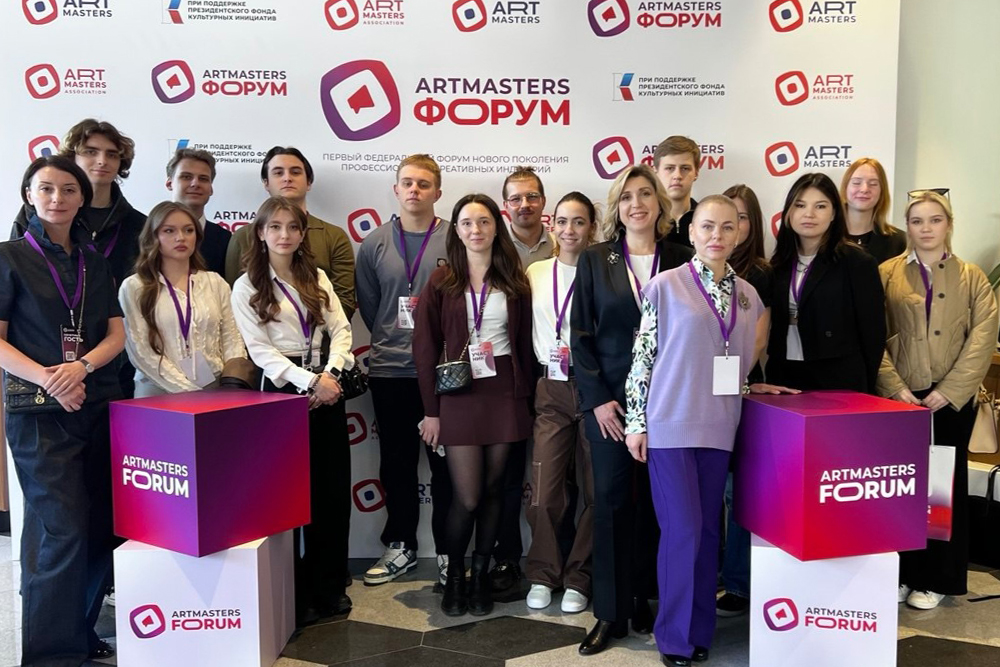
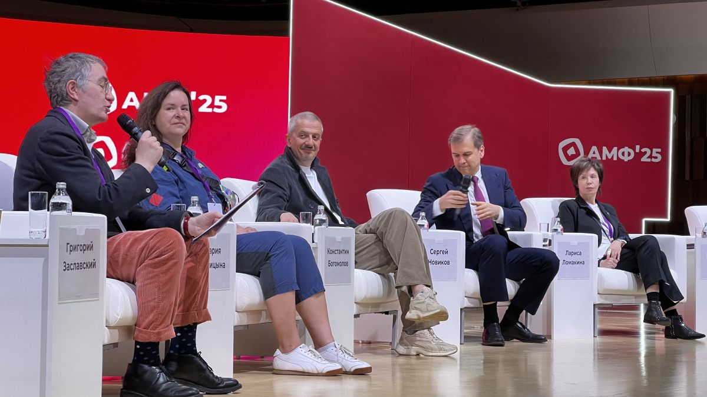
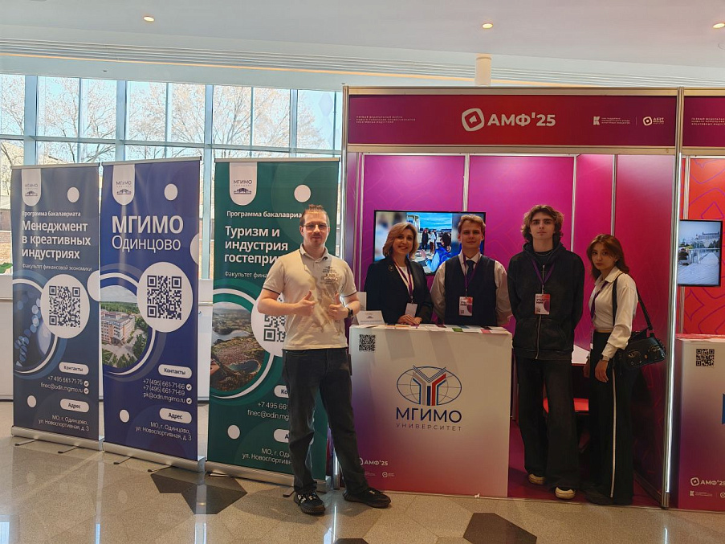

3–5 апреля состоялся Первый федеральный форум ArtMasters, организованный при поддержке Президентского фонда культурных инициатив. В мероприятии приняли активное участие студенты Факультета финансовой экономики, обучающиеся на программах «Менеджмент в креативных индустриях» и «Туризм и индустрия гостеприимства». Форум предоставил уникальную возможность будущим специалистам погрузиться в мир креативной экономики и получить опыт общения с ведущими экспертами отрасли.

Программа форума включала открытые дискуссии по различным направлениям творческих профессий, менторские сессии с участием заслуженных профессионалов в своих сферах, мастер-классы от победителей Чемпионата ArtMasters разных лет.

Открытие форума состоялось 3 апреля в концертном зале «Зарядье». В деловой программе приняли участие представители креативных индустрий, профессионалы и мэтры самых разных культурных направлений.

В рамках дискуссии «Креативные продюсеры: движущая сила всех новых идей» выступили: начальник управления общественных проектов Администрации президента Российской Федерации Сергей Новиков; генеральный директор «Первого канала», автор, медиаменеджер, продюсер Константин Эрнст; генеральный директор канала «Россия 1», продюсер кино и телевидения, медиаменеджер Антон Златопольский; ректор Российского института театрального искусства — ГИТИСа Григорий Заславский; художественный руководитель Театра на Малой Бронной Константин Богомолов. Участники обсуждали, как изменилась профессия продюсера в эпоху цифровизации, говорили о проблемах и новых возможностях отрасли.

В рамках деловой программы прошло заседание экспертного совета при комитете Государственной думы РФ по экономической политике на тему «Кадровое обеспечение креативной экономики», в котором приняли участие представители органов государственной власти и профильных образовательных учреждений.

На протяжении всего дня в фойе концертного зала «Зарядье» работала выставка, на которой посетители имели возможность познакомиться с новыми образовательными программами МГИМО в сфере креативных индустрий: «Менеджмент в креативных индустриях» и «Туризм».

4 и 5 апреля форум продолжил свою работу в Доме Пашкова Российской государственной библиотеки. Основными темами дискуссионных площадок стали кадровые потребности креативной экономики России, новые подходы к системе подготовки молодых творцов, а также возможности, предлагаемые государством творческим специалистам.

Участие в форуме дало возможность студентам Финэка оценить свои компетенции в рамках интерактивных мастер-классов, узнать о новых практических направлениях сферы креативных индустрий, установить полезные контакты с профессионалами индустрии.

Факультет финансовой экономики продолжает активно поддерживать участие своих студентов в подобных мероприятиях, способствуя их профессиональному росту и интеграции в профессиональную среду.

<iframe width="660" height="415" src="https://rutube.ru/play/embed/0c1d0f9035819ec6ed16e95522aee254/" frameBorder="0" allow="clipboard-write; autoplay" webkitAllowFullScreen mozallowfullscreen allowFullScreen></iframe>
