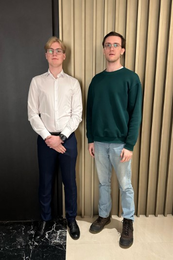
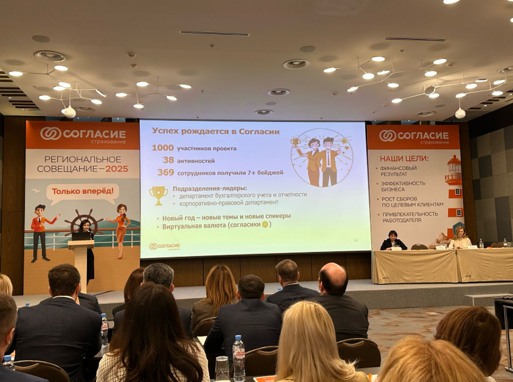

9 апреля члены студенческого клуба «Инвестор Финтеха» приняли участие в региональном совещании ООО СК «Согласие».

Главным спикером совещания выступила генеральный директор компании М.А.Тихонова, которая подвела итоги 2024 года. Майя Александровна рассказала об успехах страховой компании: рентабельность продаж в 2024 году увеличилась до 17,1% (в 2023 году — 9,2%), рентабельность капитала — с 25,6% до 48,6%, а рентабельность инвестиций — с 6,2% до 11,9%. В целом, план по финансовым результатам, эффективности и другим показателям был превышен.

После подведения итогов М.А.Тихонова наградила управляющих региональными отделениями, показавших наилучшие результаты за прошедший год, грамотами и ценными подарками.

Страховой компании «Согласие» за высокое качество потребительского сервиса был присвоен «Знак качества». В 2025 году агентство «Эксперт РА» повысило рейтинг надежности СК «Согласие» до уровня «ruAA» со стабильным прогнозом.

Участники клуба «Инвестор Финтеха» и студенты Факультета финансовой экономики получили возможность не только ознакомиться с особенностями бизнеса (розничное и корпоративное страхование, бухгалтерский учет, анализ рисков и др.), но и стать специалистами в успешной отечественной финансовой компании.

