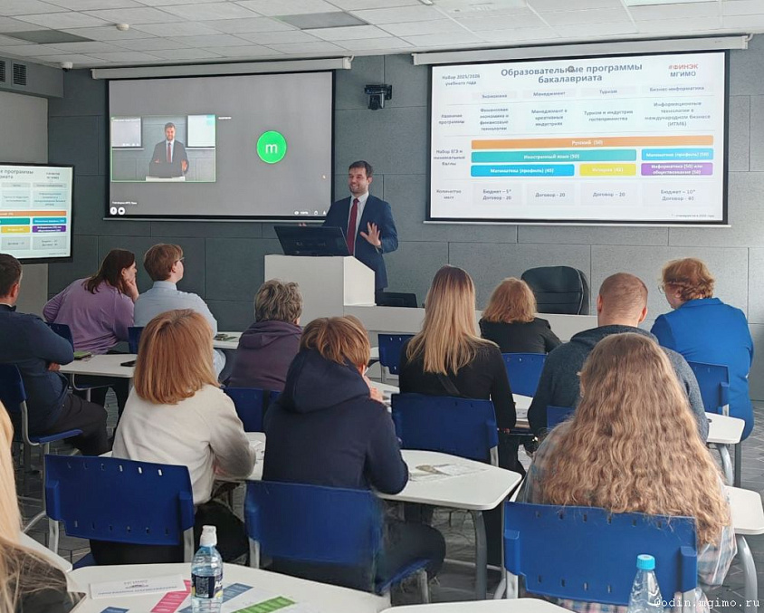
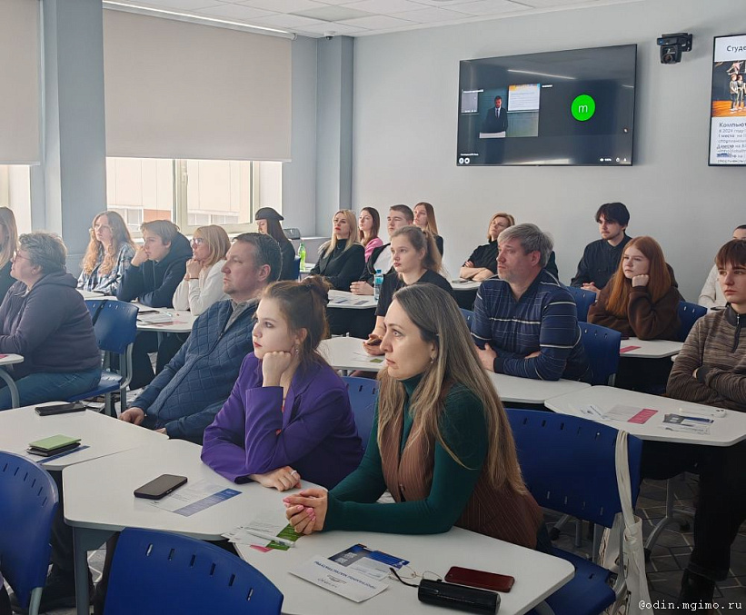

10 апреля состоялся День открытых дверей Факультета финансовой экономики МГИМО, где абитуриенты и их родители смогли познакомиться с особенностями образовательных программ факультета и карьерных возможностях, которые открываются перед его выпускниками.

Открыл встречу декан Финэка Е.В.Погребняк, который представил структуру факультета, рассказал о перспективах его развития и уникальных преимуществах образовательных программ бакалавриата Факультета финансовой экономики. Евгений Владимирович обратил внимание абитуриентов на то, что студенты факультета развивают свои профессиональные навыки не только в аудиториях, но и благодаря участию в студенческих клубах и практических выездах в организации-партнеры. В процессе обучения на Цифровой кафедре МГИМО все студенты факультета получают новые компетенции в области IT.

Руководитель программы «Финансовая экономика и финансовые технологии» Ж.М.Саркисян представила преимущества программы и перспективы трудоустройства выпускников. Жаклин Меружановна подчеркнула востребованность знаний в области платежных систем, представленных модулем от Финтех Хаба Банка России. Это подчеркивает актуальность и прикладную направленность образовательных курсов, предлагаемых факультетом.

Заместитель директора МГИМО-Одинцово Л.С.Притчина презентовала программу «Информационные технологии в международном бизнесе», реализуемую при участии Школы 21 (программирование от Сбера). Она подчеркнула важность изучения современных языков программирования и проведения проектных интенсивов с использованием программного обеспечения компаний-партнеров. Лариса Сергеевна также поделилась информацией о новой структуре учебных планов программ факультета, которая дает возможность студентам в дополнение к основному профилю получить профессиональные компетенции в рамках самостоятельно выбранной образовательной траектории по финансам, предпринимательству, энергетике и инновациям, анализу данных и другим направлениям.

Подробнее о программе «Туризм и индустрия гостеприимства» рассказали ее руководители — Т.Н.Василюк и М.С.Романов. Особый интерес у присутствующих вызвал рассказ о практико-ориентированных учебных модулях в г. Сочи и г. Владимире и регулярном проведении лекций и мастер-классов от партнеров университета. Максим Сергеевич подчеркнул, что факультет готовит специалистов, способных управлять реализацией масштабных проектов в сфере туризма и гостеприимства, направленных на повышение инвестиционной привлекательности регионов.

Заместитель декана Ю.В.Дворникова поделилась впечатлениями об участии студентов, обучающихся на программе «Менеджмент в креативных индустриях», в первом Федеральном Форуме профессионалов креативных индустрий ArtMasters. Юлия Владимировна рассказала об активном развитии креативной экономики в стране, о будущем креативных профессий и конкурентных преимуществах выпускников программы «Менеджмент в креативных индустриях». Главная особенность этой программы — проектный подход, когда студенты уже с первого курса совместно с наставниками — практиками из различных креативных отраслей развивают собственные проекты, что помогает студентам соединить теоретические знания с практической деятельностью.

Все нюансы и особенности приемной кампании 2025 года участники встречи узнали от секретаря приемной комиссии Е.А.Литвиновой, которая рассказала о количестве бюджетных мест, вступительных испытаниях, особенностях участия в конкурсе и порядке и сроках электронной подачи документов.

После завершения официальной части мероприятия гости продолжили общение с представителями факультета и студентами по частным вопросам, касающимся поступления.

День открытых дверей помог будущим студентам получить представление о том, какие перспективы открывает обучение на выбранном факультете, узнать подробнее о структуре учебного процесса, преподавателях и карьерных возможностях после окончания вуза.

<iframe width="720" height="405" src="https://rutube.ru/play/embed/af1a01b2dea11f541693e6c2c2c6fcc6/" frameBorder="0" allow="clipboard-write; autoplay" webkitAllowFullScreen mozallowfullscreen allowFullScreen></iframe>
