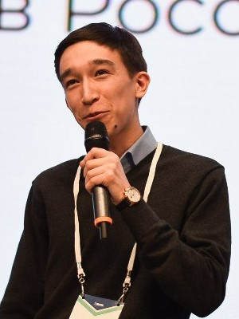
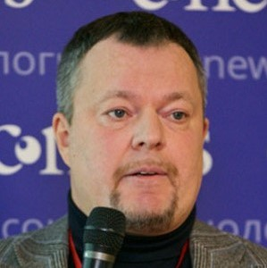
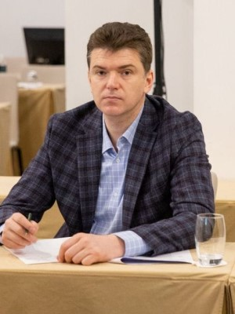
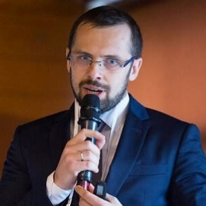
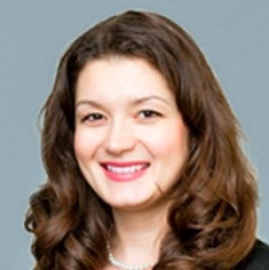
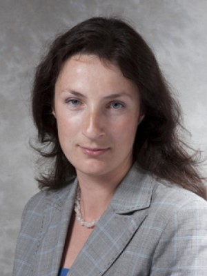
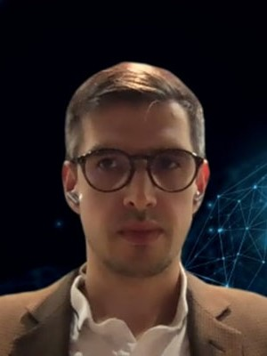

### Осип Бурлов (Zuzan)

**Стартапы - Финтех - Рынки Азии**
 
&nbsp;&nbsp;- [Мастер-класс по бизнес-моделям в финтехе](https://finec.mgimo.ru/blog/fintech-meeting-osip-burlov/)
 
&nbsp;&nbsp;- [Как в 22 года создать онлайн-конструктор мероприятий](https://rb.ru/young/zuzan/)
 
 
 
 
### Руслан Гулевич (Илим)

**Цифровая трансформация - Словарь бизнеса**
 
&nbsp;&nbsp;- [Лекция "Цифровая трансформация. Люди. Культура. Язык."](https://finec.mgimo.ru/blog/gulevich-digital-transformation/)
 
 
 
 
 

### Захар Калмыков (ГК Родина)

**Цифровой финдиректор - Digital CFO**
 
&nbsp;&nbsp;- [Как поменялась экономика девелоперского проекта](https://www.mirkvartir.ru/journal/news/2022/05/30/rodina/)
 
 
 
 

### Владимир Козлов (ИД Регламаент)

**Управление рисками - Управление данными**
 
&nbsp;&nbsp;- [Программные продукты в области риск-менеджмента](http://raisk.ru/)
 
 
 
 
 

### Иван Коршиков (Тинькофф)

**Финансовые рынки - Валютный трейдинг**
 
 
 
 
 
 

### Юлия Лебедева (Авиа Центр)

**Корпоративные финансы**
 
 
 
 
 
 

### Мария Маракуева (Европейский университет)

**Управление рисками - Бановские технологии**
 
&nbsp;&nbsp;- [Лекция "Банковские риски - как управлять неизвестным?"](https://finec.mgimo.ru/blog/marakueva-lecture-how-to-control-uncertainty/)
 
 
 
 
 

### Александр Полудницын (НСПК)

**Платежные системы**
 
&nbsp;&nbsp;- [От майнора по предпринимательству до магистратуры по Инноватике](https://www.hse.ru/inman/news/796736389.html)
 
 
 
 

### Виктория Федотова (Мастерчейн)

**Цифровые финансовые активы**
 
&nbsp;&nbsp;- [Tech Week 2022 в Сколково](https://www.masterchain.ru/news/mastercheyn-prinyala-uchastie-v-rabote-tech-week-2022-v-skolkovo/?ysclid=li1jhbksvf20498695)
 
 
 
 
 
 

### Дмитрий Якубовский (Сбер)

**ИТ в банках - Старт карьеры**
 
&nbsp;&nbsp;- [Мастер-класс "Текущее состояние рынка труда в ИТ-секторе"](https://mgimo.ru/about/news/departments/yakubovskiy/)
 
 
 
 
 

### Михаил Горст (ВЭБ)

**Институциональная экономика**
 
&nbsp;&nbsp;- [Мастер-класс "Новая институциональная экономика"](https://odin.mgimo.ru/about/news/departments/gorst/)
 
 
 
 
 

### Павел Самиев (Бизнес-Дром/ex-Ингосстрах)

**Финансовые рынки**
 
&nbsp;&nbsp;- [Лекция "Современная структура финансового рынка России"](https://odin.mgimo.ru/about/news/departments/samiev/)
