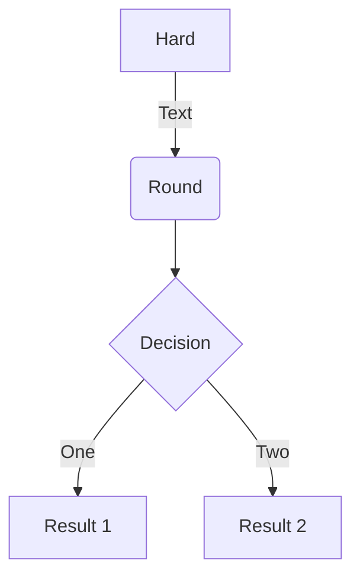

## Инструкция

<https://getdoks.org/docs/how-to/extra-features/mermaid/>

## Примеры из инструкции


graph TD
A[Hard] -->|Text| B(Round)
B --> C{Decision}
C -->|One| D[Result 1]
C -->|Two| E[Result 2]


## Из задачи \#192

```mermaid
flowchart TB

    D0 --> F1

    G2 --> F1
    G3 --> H1
    G4 --> F1
    G5 --> F1

    F1 --> G1
    E2 --> I1
    E1 --> H1

    A3 --> H1
    A4 --> H1
    A5 --> H1

    A5 --> E1
    A7 --> J2
    J2 --> G1

    A8 --> C0
    A3 --> K2
    B1 --> L1
    B2 --> M1

    subgraph finec.mgimo.ru
        A1(Главная страница)
        click A1 "https://finec.mgimo.ru" _blank

        A2(Бакалавриат)
        A1 --> A2

        A3("Экономика (ФЭТ)")
        click A3 "https://finec.mgimo.ru/program/undergrad/economics/" _blank
        A4("Бизнес-информатика (ИТМБ)")
        click A4 "https://finec.mgimo.ru/program/undergrad/itmb/" _blank
        A5("Туризм (ТиГ)")
        click A3 "https://finec.mgimo.ru/program/undergrad/tourism/" _blank
        A2 --> A3
        A2 --> A4
        A2 --> A5

        A6("Магистратура")
        A1 --> A6

        A7(Цифровые финансы)
        A8(Искусственный интеллект)
        A6 --> A7
        A6 --> A8
    end

    subgraph mgimo.ru
        B0(Главная страница)
        click B0 "https://mgimo.ru" _blank

        B1(Лицей)
        B2(Колледж)
        B3(Бакалавриат)
        B4(Магистратура)
        B5(Аспирантура и докторантура)
        B6(MBA и EMBA)
        B0 --> B1
        B0 --> B2
        B0 --> B3
        B0 --> B4
        B0 --> B5
        B0 --> B6

    end

    subgraph ai.mgimo.ru
        C0(Лендинг)
        click C0 "https://ai.mgimo.ru" _blank

        C1(Подать заявку - форма)
        click C1 "https://ai.mgimo.ru/#applic" _blank

        C0 --> C1
    end

    subgraph digitalfinance.mgimo.ru
        D0(Лендинг)
        click D0 "https://digitalfinance.mgimo.ru" _blank
    end

    subgraph tourism.mgimo.ru
        E0(Лендинг)
        click E0 "https://tourism.mgimo.ru/ba/" _blank

        E1(Бакалавриат)
        click E1 "https://tourism.mgimo.ru/ba/" _blank

        E2(Магистратура)
        click E2 "https://tourism.mgimo.ru/ma/" _blank

        E0 --> E1
        E0 --> E2
    end

    subgraph lka.mgimo.ru
        F1(Личный кабинет)
        click F1 "https://lka.mgimo.ru" _blank
    end

    subgraph odin.mgimo.ru
        G1(Абитуриенту МГИМО 2022)
        click G1 "https://odin.mgimo.ru/news/5473-abiturientu-mgimo-2022" _blank

        G2("Среднее профессиональное образование (колледж)")
        G3("Бакалавриат (граждане РФ)")
        click G3 "https://odin.mgimo.ru/news/5487-priemka-2022-nachalsya-priem-dokumentov-na-programmy-bakalavriata" _blank

        G4("Бакалавриат (иностранные граждане)")
        G5(Магистратура)

        G1 --> G2
        G1 --> G3
        G1 --> G4
        G1 --> G5
    end

    subgraph bac.mgimo.ru
        H1(Личный кабинет)
        click H1 "https://bac.mgimo.ru/" _blank
    end

    subgraph master.mgimo.ru
        I1(Личный кабинет)
        click I1 "https://master.mgimo.ru/" _blank
    end

    subgraph pk.odin.mgimo.ru/
        J1(Главная страница)
        click J1 "http://pk.odin.mgimo.ru/" _blank

        J2("Магистратура "Цифровые финансы"")
        click J2 "http://pk.odin.mgimo.ru/master/cf.html" _blank
    end

    subgraph abiturient.mgimo.ru
        K1(Главная страница)
        click K1 "https://abiturient.mgimo.ru" _blank

        K2(Бакалавриат)
        click K2 "https://abiturient.mgimo.ru/bakalavriat" _blank

        K1 --> K2
    end

    subgraph lyceum.mgimo.ru
        L1(Главная страница)
        click L1 "https://lyceum.mgimo.ru/" _blank
    end

    subgraph college.mgimo.ru
        M1(Главная страница)
        click M1 "https://college.mgimo.ru/" _blank
    end
```

